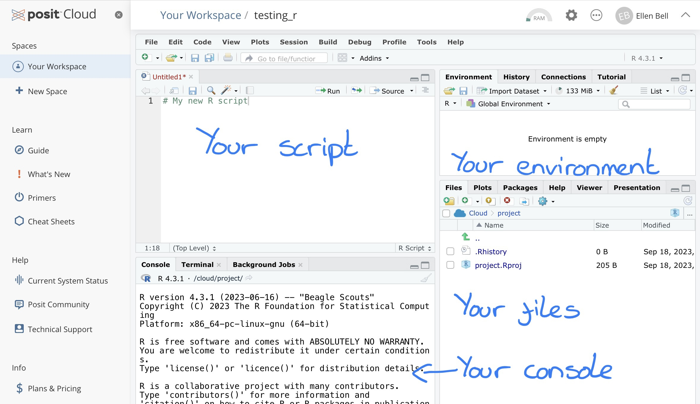

```{r setup, include = FALSE}
knitr::opts_chunk$set(eval = FALSE)
```

# Some fundamentals to effective use of R {#c2}

If you are already familiar with R this chapter will be a very swift refresher, you should still work through it though, it will also provide a good overview of posit Cloud.

Login to you posit Cloud account and go into your `testing_R` project (see Chapter \@ref(intro-to-posit) if you haven't done these steps yet)

## Entering commands directly into the console

Lets start by playing with some commands in the console. Type or copy and paste the simple calculation (or command) shown below, into the console. Your text should appear next to the `>` symbol. Press `Enter` on your keyboard, this will instruct R to run the command. 

```{r}
5 + 9
```

The two final lines of your output should look like this:

```
> 5 + 9
[1] 14
```

So... your initial command `5 + 9` is shown after the `>`, symbol and the resulting output from R is shown after `[1]`. Don't worry too much about the syntax of `>` and `[1]` here. You can think of `>` as meaning that R is ready to receive a command and `[1]` as R telling you that the answer to the first part of your question is here (in this case `14`). 

Try out some other commands... What happens when you input the following?

```{r}
362 * 12
```

```{r}
55 / 5
```

```{r}
(40 / 990) * 100
```

```{r}
4^2
```

See if you can work out what 30% of 735 is using the R console

## Using an R script {#using-an-r-script}

I have already mentioned the __reproducibility__ factor as an advantage of using posit Cloud. This is because you can record and run all of your commands from an R script within posit Cloud. This means that you have a written record of your analysis workflow, what you did to your data at which stage, and you can do all of this without altering the original data files! This is super important because it means that if you revisit your work in a few weeks/months/years you can see exactly what you did AND if someone else needs to rerun any of your analysis or use your workflow on some other data, they can! 

So lets go about setting up your new script. You currently have three panels in posit Cloud. If you go to __file > New File > R Script__ a new panel will open.

```{r, eval=TRUE, echo=FALSE, out.width="90%", fig.alt= "creating a new r script", fig.cap ="How to create a new R script"}
knitr::include_graphics("figures/posit6.jpg")
```

```{r, eval=TRUE, echo=FALSE, out.width="90%", fig.alt= "Screen for your r studio workspace", fig.cap ="The four panels of an R Studio workspace"}

```

This new panel is essentially a text file where you can write your commands into a script and then send them down to the console when you want to run them. Lets have a play. Copy the below into your new R script. 

```{r}
362 * 12

55 / 5

(40 / 990) * 100

4^2
```

These are all commands you have run before but now if you save your script you will have a text based document with your progress saved. It doesn't make a huge amount of sense to do this now because these are just a un-associated set of calculations and we are just playing with the interface, but you could if you wanted to. 

Ok, so now we are ready to execute our commands. You can do this with each calculation individually, line by line, or you can run the whole script. 

To run your script line by line, place your cursor on the line you wish to run and you can either;

* Click on the __Run__ button on the top right of the script panel
* Press __ctrl + Enter__ (or __Command + Enter__ on mac) 

Or if you wish to run the entire script you can either;

* Manually highlight the script and click the __Run__ button or press __ctrl + Enter__ (or __Command + Enter__ on mac) 
* Press __ctrl + A__ (or __Command + A__ on mac) and then click the run button or press __ctrl + Enter__ (or __Command + Enter__ on mac) 

## Creating objects 

As we have just seen, R can be used to perform calculations. However, we can use R to perform tasks that are much more complex. In order to do this we are going to have to learn about objects. 

Create a new R script in your current and save it under the name `objects`. You should see it appear as `object.R` under the __Files__ tab in the bottom right panel. Run the following command using your script.

```{r}
A <- 50
```

What you have essentially done here, is told R to create an object called `A` and to store the number `50` inside it using the syntax `<-`. After running the command you should see your object `A` and `50` pop up under __Environment__ and __Values__ in the top right hand panel, so you can see that `50` has been stored in `A`.

Lets create some more objects;

```{r}
B <- 6
```

Now see what happens if you run the following command;

```{r}
A * b
```

Oh dear... we have an error...

```
> A * b
Error: object 'b' not found
```

This is because R has absolutely no flexibility with typos. It is looking for an object called `b` when there is no object called `b` in your environment. There is an object called `B`, but to R, `B` and `b` are completely different things. Try running this instead; 

```{r}
A * B
```

Hopefully you should now have an output that looks like this 

```
> A * B
[1] 300
```

This is a very simple example. But lets try to demonstrate why saving values within objects may be useful. Lets say you are interested in looking at the number of students who get freshers flu in Week 1 of teaching at UEA. You have a class size of 200 students and 15 of them report that they have contracted freshers flu. Use the following script to calculate the percentage of students with freshers flu. 

```{r}
# Create two objects, one for your total class and one for those that have flu
# Notice that neither of my object names contain spaces
# If you need a space always use an underscore or full stop
total_class <- 200
with_flu <- 15

# Calculate the percentage of students with flu in week 1
percentage_with_flu <- (with_flu/total_class)*100
```

If you look in your Environment in the top right panel you should see the percentage of students with flu calculated and stored under `percentage_with_flu`. You can use the following command to see it printed in the console.

```{r}
print(percentage_with_flu)
```

Some students have been late in reporting their symptoms. A week later you hear that `7` more students also had freshers flu in Week 1. If you had been typing into the console and not using objects you would have to type this script out all over again. But you don't need to. You just need to change your entry for `with_flu` from `15` to `22`. Do that now and re-run the script. By editing the `15`, R will overwrite the object `with_flu` to represent the new value of `22`. If you run the last line of code then the percentage of students with flu will also update. 

This may seem like a very simple example, and it is, but we are still building up your knowledge of R so you will have to take my word for it that objects will be very helpful to you as we progress :). You will also see, that objects can contain a range of different types of data. We will cover some of these in lectures, but for now lets leave objects and have a think about functions and packages. 

## What are functions and packages?

If you have the coding skills it is possible to do pretty much whatever you like with your data in R. However, why reinvent the wheel trying to write your own complex scripts, when a lot of very clever coders have already written lots of functional bits of code, known as __functions__, for general use. Functions can be thought of as a piece of code that is designed to perform a set task. R comes with lots of functions already built in, but there are also lots of additional functions that are stored in __packages__.

Packages are containers that can hold sets of functions or data and as the course progresses you will use a range of packages that contain useful functions and data. For example the data visualisation package (which you will become very familiar with later on) `ggplot2` contains ranges of functions which allow you to define how your plot or graph will look, for example `geom_bar` is a function within the `ggplot2` package that contains the instructions required to build a bar chart. 

### Using functions

We actually have already had some exposure to functions. You used the print function earlier when you asked R to print out the value contained within the `percentage_with_flu` object. But lets have a go at using another function. 

```{r}
# First of all we need some data
# Notice the syntax, by using c() I have told R to prepare for a list of values
# Each value is separated by a comma
data <- c(2,4,6,8,10,12,14,16,18,20)

# Now I want to know what the total value of data is if I add all the values stored within it together
total <- sum(data)
```

In the above piece of code we have created some data, as a list of values, and stored them under the object name data. We have then used the function `sum()`. We have essentially told R that we wish it to perform the function `sum()` on everything contained within the object `data` and store it in another object called `total`. You can see the value within `total` in your environment, can you work out how to get R to print the value of `total` out?

If you ever need help working out how to use a function you can use another function `help()`. Try inputing the code below into your console.

```{r}
help(sum)
```

This should bring up a help file in your bottom right hand panel that describes and explains the use of the function `sum()`.

### Installing packages {#installing-packages}

The `sum` function is part of the base R package that comes with any R installation. However there are lots of other useful functions that are held in additional packages. In order to use these functions, you must have the necessary packages installed in your work space. I already mentioned that we would be using a package called `ggplot2`, lets try installing and loading it in your work space. 

With any package you wish to use in posit Cloud you will need to go through a two step process, first of all you need to __install__ the package using the `install.packages()` function (see below for usage and then you will need to __load__ it using the `library()` function. We only need to install and load a package once per posit Cloud project but I would generally keep the commands for installing and loading packages at the top of the script I'm working on.

Try copying and running the following lines in your script;

```{r}
install.packages("ggplot2") # Install the ggplot package
library(ggplot2) # Load the ggplot package
```

Now we can try to make a simple plot using some functions from the `ggplot2` package and using an example data set called `iris` that is stored in the base R `datasets` package. 

Copy the following command into your script and run it

```{r}
# First load the base R datasets in your workspace
library("datasets")

# Then call the ggplot function and tell it that the data set you wish to use is called iris
# We then need to tell ggplot how to map our variables
# The aes function is an aesthetic tool that allows us to define variables for the x and y axes
# We then use the geom_point function to instruct R to built a scatter plot
# A second use of the aes function tells R to color points by species
ggplot(data = iris,aes(x = Sepal.Length, y = Sepal.Width)) + 
  geom_point(aes(colour=Species)) 
```

Those sharped eyed among you may have noticed that the short script defining our plot goes over two lines and contains a `+` and an indentation on the second line. The `+` and indentation is essentially allowing you to pipe one line of code into the next. This allows you to add more detailed instructions on how you would like your graph to be built and linking together multiple functions. Don't worry if this is a lot to take in at this stage, as we progress with `ggplot2` we will revisit this in more detail. 

## Analysis hygiene 

Hopefully you can see how having a script could make your work all the more reproducible. There are a few good "hygienic" practices that, if you can get into the habit of using, you're future self will thank you.

### What's in a name?

While you're running analyses you will find youself naming lots of things, including; variables, files, objects, etc. I am going to take a moment to go over a few good rules to follow.

* Keep names meaningful - Over the course of your MSc you will create a lot of files and folders/directories. You will also frequently be naming data variables and objects. You need to be able to easily recognise what is what so informative names are better then arbitrary names. So `girraffe`, `elephant`, `hippo` are better names then `1`, `2` and `3`. 

* Make versions obvious - There will be occasions when you want to save new information in a file or object but keep the original untouched. You may be experimenting or you may want the option to revisit to your original work. In these instances it makes sense to save your edits to a new version of the original file or object. If you do this and especially if you are sharing it with others make it clear. I tend to add my initials and a version identifier (e.g. v1, v2) as a suffix to the file name. 

* Keep names short - Typing takes time, its boring, and the more you type the greater the risk of a typo. So keep names short. So `trunk_length` is better than `elephant_trunk_length_cm`, there is important information in the second name but you can store this as a comment or a note. 

* Avoid spaces - Lots of software packages hate spaces, including R. If you can get out of the habbit of using spaces and instead use `_` your future self will thank you. 

* Abide by the rules for R - R does have some rules of its own for naming. Names must __not__ start with a number, but numbers may be used provided the first character is a letter. You can also use `.` or `_`, but avoid spaces at all costs. You may use upper or lower case letters, but remember R is case sensitive so will see `Elephant` and `elephant` as different. I try to keep to a lower case and use `_` instead of spaces, it keeps everything uniform and saves me time (this style is known as snake_case).

### Directories and their structure 

Working with text based interfaces like R, where you are writing and running commands, means that we need to have some understanding of the underlying computer architecture. You need to have some appreciation for how files are organised within folders/directories and why its important to know which directory you are working from with R.

Under __Files__ in the bottom right panel of your screen you will see a file with the ending .Rproj. This is an R project file which tells R where you are working in the server. It means that R will automatically treat your project location as the __working directory__. If you wish to access files in any of the folders you have just created you will need to tell R the __path__ that it needs to follow in order to access these files. There are two types of path;

* __absolute__ paths, which refer to the same location in a file system relative to the root directory (don't worry if that doesn't make too much sense at this stage). For example, in Figure 4.2, if you wanted to access files in the `/work` directory but were already in any of the other directories like `/dev`, an absolute path would work from wherever you were working this would be `/home/jono/work`.
* __relative__ paths, which refer to a location in the file system relative to the directory you are currently working in. For example, in Figure 4.2, if you were working in the `/home` directory and wanted to access files in `/work` a relative path would look like `jono/work`. This is fine from the `/home` directory, but the path would not work if you were working in, for example `/lib`. 

```{r, eval=TRUE, echo=FALSE, out.width="90%", fig.alt= "Absolute vs relative paths", fig.cap ="Absolute vs Relative Paths"}
knitr::include_graphics("figures/absolutePathNames.jpg")
```

Here we will only be dealing with __relative__ paths because you will always be working from within your R project directory. So for example if you wish to access a file in your `data` folder in the R project you would need to provide the path `("data/any_sub_folders_you_may_have_made/the_file_you_wish_to_access")`. We will do this in the next step so don't worry if you don't quite get it yet. 

### Workspace set up {#workspace-setup}

Its always good to keep a clean, well organised and tidy workspace, generally I will start a new project in posit Cloud if I am working on a new series of questions with a new data set or sets.

We will be moving towards doing some fairly comprehensive data handling so setting up your workspace is going to become more and more important. If you can get into the habit of setting up your workspace properly at the start of each project you will thank yourself later. A well developed project will contain several files including;

* Input data 
* Analytical scripts
* Outputs that may include plots and tables

Whenever you create a new RStudio Project, under __Files__ in the bottom right panel create a __New Folder__, for each of the following;

* data
* scripts
* figures

__Make sure you copy the names over exactly if you're using bits of code from this workbook, it will minimise errors__

A tidy workspace will help you find the things you need when you need them and will reduce the risk of loosing things. 

### Script set up {#script-setup}

Having a uniform script set up can also help you in the future, especially if you are working with multiple scripts. Lets have a go at setting up a clean and tidy script. 
Create a new R script by clicking on the icon with a little green plus (as you did in Chapter \@ref(using-an-r-script)), below __File__ in the top left of the posit Cloud window and select __R Script__. Call your new script `script_hygene`. Its always good to add a few lines of description at the start of your script, this tells your future self and anyone else what the script is doing. Copy over the following.

```{r}
# An example of a lovely clean script that will help me build excellent data hygiene habits
# Your name
# Date
```

Then we need to install and load any packages that we might want to use, copy over the following as an example;

```{r}
install.packages("tidyverse")
install.packages("janitor")
library(tidyverse) # Load the tidyverse package
library(janitor) # Load the janitor package
```

You're script is now ready for you to import some data and start analysing with the packages `tidyverse` and `janitor`. 

### Comment on your work

When you are writing a script you can leave notes for yourself. This can be extremely useful if you need reminding on what a particular piece of script is doing. This is a good learning tool while you are still learning how to use R, but its also a good habit to get into for later. As you progress with R you will inevitably start constructing quite intricate scripts, leaving good notes on what each part of the script is doing is very useful for you and for anyone else who may later come to use your script. You can leave notes or comments in scripts if you precede them with `#`. If R sees `#` it will ignore all text on that line that comes after it. For example, copy and paste the following into your script and try running it line by line.

```{r}
# Four squared can be calculated with the following command
4^2
```

In this case I have reminded myself how to calculate 4 squared, everything after the `#` will be ignored by R when you try to run the line. 

Comments are also super useful if you only need to use a line of code once. Like when you install packages. for example in your script set up, once you have installed your packages you may see the following; 

```{r}
#install.packages("tidyverse")
#install.packages("janitor")
library(tidyverse) # Load the tidyverse package
library(janitor) # Load the janitor package
```

Notice that their is a `#` at the beginning of the `install.packages` line. This is called commenting out. And we do it because you only need to install a package once in your RStudio project but it is useful to have a record of what packages have been installed. You may also need to reload packages after installation, hence why the `library` function hasn't been commented out. 

## What do I do if I get an error message?

Error messages are almost guaranteed when working regularly with R, they are super common, don't panic when you eventually run into one. In fact you may remember that we already encountered one earlier in this chapter, that particular error was caused by a typo. Generally the most common causes of error messages are;

* A typo (you can reduce risk of this by consistently labeling your files and objects)
* A mistake in syntax (missing or un-closed; `()`, `""`, or missing `,`)
* Missing dependencies (maybe you didnt install or load a package correctly, or maybe if your running a longer script, you are trying to call an object that you haven't created yet)

This is by no means an exhaustive list but when I run into errors its normally because of one of the above. The trick is don't panic and read the error message carefully, it often tells you what is wrong. Then look over your script slowly to troubleshoot. And if you are genuinely stuck and the error doesn't make sense, run it through Google, I can almost guarantee you wont have been the first person to have that error message. 

Well done everyone. I hope you have enjoyed this weeks session. Next week is our first workshop and we will start to use some of these new found skills in tandem and start to look at using them on some new data. 

## Before you leave!

Log out of posit Cloud and make sure you save your script(s)!

## References

Firke, S., 2021. Janitor: Simple Tools for Examining and Cleaning Dirty Data. https://github.com/sfirke/janitor. <br />
Wickham, H., Averick, M., Bryan, J., Chang, W., D’Agostino McGowan, L., François, R., Grolemund, G., et al., 2019. “Welcome to the tidyverse.” Journal of Open Source Software 4 (43): 1686. https://doi.org/10.21105/joss.01686. <br />
Wickham, H., Chang W., Henry, L., Pedersen, T.L., Takahashi, K., Wilke, C., Woo, K., Yutani, H., and Dunnington, G., 2021. Ggplot2: Create Elegant Data Visualisations Using the Grammar of Graphics. https://CRAN.R-project.org/package=ggplot2.<br />
Wickham, H., François, R., Henry, L., and Müller, K., 2021. Dplyr: A Grammar of Data Manipulation. https://CRAN.R-project.org/package=dplyr. <br />
Wickham, H., Hester, J., and Bryan, J., 2021. Readr: Read Rectangular Text Data. https://CRAN.R-project.org/package=readr.


