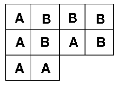
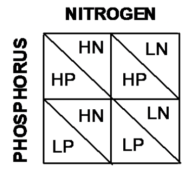

# Workshop 4 - Introduction to Design and Analysis of Experiments

## Introduction

There are two simple requirements that should guide the design of experiments: randomisation and replication. Replication is necessary because biological systems are variable, and so we need multiple measurements to distinguish meaningful effects from random variations. As the number of replicates or measurements increases, the standard error of the mean of the data becomes smaller.
The concept of randomisation is straightforward: if we set up an experiment to compare the behaviour of 2 species of lizard, for example, but place all our replicates for one species in one tank, and all our replicates for the other species in another tank, then we could not be certain whether the differences we observe are due to measurement error, or due to the differences between the tanks. Randomising an experiment can be done using tables of random numbers to allocate different treatments to your experimental units.

### Experimental Design {-}

The layout in Figure 4.1 is an example of a randomised design: we have two treatments (A & B), with five replicates of each treatment. There are 10 plots in all, and the experiment was randomised. This type of arrangement is called a completely randomised design.
There is a potential problem with the completely randomised design, however. This is because there is no restriction on the allocation of treatments to experimental units. All units from one treatment can, for example, end up on one side of the experimental area purely by chance. In the example in Figure 4.1, for example, all the units on the left are treatment A. This would be bad if these units differed in levels of moisture, temperature, nutrients etc.

```{r, eval=TRUE, echo=FALSE, out.width="40%", fig.alt= "Completely randomised design", fig.cap ="Completely randomised design"}

```

One of the easiest ways to control for this kind of problem is through a blocked design, as seen in Figure 4.2. This is achieved by first grouping the experimental units into blocks. Each block contains as many experimental units as there are treatments; the allocation of treatments to units is then randomised within each block. This design considerably reduces the possibility of producing an uneven arrangement of treatments. The blocked design is an improvement over the completely randomised design. It cannot, however, deal with trends across the experimental area.

```{r, eval=TRUE, echo=FALSE, out.width="40%", fig.alt= "Blocked design", fig.cap ="Blocked design"}
knitr::include_graphics("figures/blocked.png")
```

Trends across experimental areas can sometimes be controlled by a form of design known as a Latin Square, see Figure 4.3. The key to this design is that treatments are organised into rows and columns. In the example on the left, there are three treatments and each row and each column contains one of each treatment (a bit like sudoku). Blocked and Latin square designs may be mixed, but be warned, they can be difficult to analyse.

```{r, eval=TRUE, echo=FALSE, out.width="40%", fig.alt= "Latin square design", fig.cap ="Latin square design"}
knitr::include_graphics("figures/latin_square.png")
```

A multitude of different experimental designs exist: the examples above are the commonest forms of design, and illustrate how the experimenter can develop a design to cope with natural, uncontrollable variations in order to best study the biological factors of interest. Other designs include split plot designs that attempt to deal with practical restrictions. For example, if plot size were 3m x 3m but the equipment required to apply the treatment covers a minimum area of 12m x 3m, then we could not randomise the treatment. Instead we split the 12m x 12m plot into 4 plots. In Figure 4.4, the grey and white show one factor, which is applied in a split plot fashion; the other (1, 2, 3, 4) is completely randomised.

```{r, eval=TRUE, echo=FALSE, out.width="40%", fig.alt= "Split plots", fig.cap ="Split plots"}
knitr::include_graphics("figures/split_plots.png")
```

When we take measurements from the same experimental unit (e.g. if we measure the effects of a treatment on the growth of an animal at several points through its life) we repeatedly take observations from the same unit. This type of design is called a repeated measures design. Analysis of this type of design accounts for both the treatment effect and the temporal sequence of measurements.

### Analysis of Variance {-}

Last week we saw that the difference between two groups can be analysed using a t-test. The t-test can only be used to compare two groups. When our experiment contains 3 or more groups, we use a technique called ANalysis Of VAriance or ANOVA for short.

The null hypothesis in an ANOVA is that samples from different treatments are drawn from different populations with the same means. If our analysis indicates that the probability that this hypothesis is true is less than 1 in 20 (p<0.05), then at least one of the treatments has a different mean from the others. ANOVA uses the data to calculate two estimates of the variance in the populations;

1) Within-treatment (error) variance is an estimate of the mean variance found within each treatment. It is calculated by summing the variances found within each of the samples (remember this is the ‘Sum of Squares’ - the sum of the squared deviations from the mean) and then averaging them (the Mean Squares - Sum of Squares/DF).
2) Between-treatment variance is an estimate of the variance between the sample means. It is calculated by summing the differences between each treatment mean and the overall mean of all of the treatments together, and then averaging them.

If the means of the treatments vary but the variance within the treatments is similar to the variance between treatments, then it will be unlikely that significant differences between the treatments can be identified. By contrast, if the within-treatment variance is small relative to the between-treatment variance, then it is more likely that statistically significant differences between the means will exist. We therefore need to be able to compare within- and between- treatment variances to determine whether the null hypothesis is likely to be true. This is done by calculating the ratio of these two variances, called the F-ratio. If the within and between treatment variance estimates are the same, then F = 1. If the between-treatment estimate of variance is greater than the within-treatment estimate of variance, then the value of F will be much bigger than 1. Clear differences between treatments therefore result in larger values of F. For a given value of F, and for a given number of treatments and replicates, we can then calculate the probability that the null hypothesis (no difference between treatment means) is true: again this critical level is 1 in 20, or p<0.05. There is a standard way of presenting the results of an ANOVA in a table, it looks something like this:

_Table 4.1_ Example ANOVA summary results

| Source | DF | Sum of Squares | Mean Square | F-Ratio | Probability |
|:------:|:--:|:--------------:|:-----------:|:-------:|:-----------:|
| Between | 2 | 634.08 | 317.04 | 42.44 | 0.000 |
| Within | 21 | 156.88 | 7.47 |
| Total | 23 | 790.95 |

There are four key things to look for;

1) **Mean Square (MS):** this is the average variance, and it is calculated __between__ and __within__ treatments, by dividing the respective Sums of Squares by DF.
2) **F-Ratio:** this is Between MS divided by Within MS. Remember large values (>>1) imply differences.
3) **Degrees of Freedom:** if you have T treatments and r replicates (in the above table, T = 3 and r = 8), then Between-treatment DF is calculated as T-1. Within-treatment DF = T(r-1) and Total DF = Tr-1.
4) **Probability:** this is the probability of obtaining that value of F for those samples sizes.

With ANOVAs we are not limited to analysing the effects of just one factor: in an agricultural experiment we could, for example, vary the levels of two different nutrients. For example: <br />
Consider an experiment in which we varied Nitrogen (High and Low) and Phosphorus (High and Low). There are 4 Combinations of nutrient levels. This means that we are interested in three comparisons (see Figure 4.5);

1) HN vs. LN
2) HP vs. LP
3) HP and HN vs. LP and LN

```{r, eval=TRUE, echo=FALSE, out.width="40%", fig.alt= "Design for our Nitrogen and Phosphorus experiment", fig.cap ="Blocked design"}

```

Out of these treatments, 1. and 2. are termed Main Effects: these are the basic factor levels that we have varied. 3. is termed an Interaction term.

We may find that increasing the level of either N or P on their own increases yields. However, these effects may not be independent. When combined, high levels of both N & P may increase yields by more than the sum of their individual effects (synergistic) or by less than the sum of their individual effects (antagonistic). Interaction effects are tested in exactly the same way as main effects, using an F-ratio. The ANOVA table is slightly modified:

_Table 4.1_ An example of summary results from a more complex ANOVA 

| Source | DF | Sum of Squares | Mean Square | F-Ratio | Probability |
|:------:|:--:|:--------------:|:-----------:|:-------:|:-----------:|
| Nitrogen | 1 | 376.04 | 376.04 | 108.74 | 0.000 |
| Phosphorus | 1 | 3.37 | 3.37 | 0.97 | 0.335 |
| Nitrogen * Phosphorus | 1 | 84.37 | 84.37 | 24.39 | 0.000 | 
| Error | 20 | 69.19 | 3.45 |

In this example there is a significant effect of nitrogen on yields, but not phosphorus. In addition, the significant interaction term indicates that the response of yields to nitrogen varies depending on the level of phosphorus. ANOVA can tell us when there are significant differences between the means of treatments, but it cannot identify which treatment differs from which other treatments. Post hoc tests are used to find where differences lie. Tukey’s Honest Significant Difference is a widely used post-hoc test. Post-hoc tests are briefly explored in the practical. We will go on to look at how to test for relationships among different variables, as opposed to differences between them.

## Practical 4 - Introduction to Analysis of Variance 

### Aims

The aim of this week’s practical is to introduce the analysis of experimental data using one- and two- way analyses of variance (ANOVA). These analyses are used for testing for differences between treatments in fully randomised experiments. Note that other forms of experimental design, such as the randomised block and the Latin square require modified forms of ANOVA, although the basic ideas are the same.

### The Data

We will be continuing with the rather agricultural theme for todays practical, the data are from one of the previous module leaders (Rob Freckleton) and are very appropriate for demonstrating key points around ANOVA. As an historical aside, this is also rather appropriate, as ANOVA and many other statistical analyses were designed by R. A. Fisher whilst working on long-term crop yield studies at Rothamsted. <br />

Today we are going to look at data from two experiments: <br />

* **Experiment 1.** Comparison of the yields of four different carrot varieties. In this experiment, six plots of each of the four varieties were grown, with the plots allocated to varieties in a completely random manner.
* **Experiment 2.** Effects of light and sex on feeding behaviour in chickens. This experiment aimed to determine the effect of light colour and sex on the rate at which chickens feed. Feeding rates were measured as the number of pecks made in a 15 minute period. There were 24 cages in total, half of which were illuminated with white light, and half with red light. Half of the 12 white-light cages were allocated a male chicken, and half a female chicken, and the same for the 12 red-light cages. The treatments were allocated to cages in a completely randomised manner.

### Task 1 - Setting up your workspace

Log into posit Cloud, enter the classroom work space and open the project called __Workshop_4__. Set up a new script in posit Cloud. 

You will need to ensure that the packages `tidyverse` and `car` are installed and loaded to complete todays workshop, check Chapter \@ref(workspace-setup) and Chapter \@ref(script-setup) if you are unsure how to do this. 

### Task 2 - Checking the data {#c5t2}

To start with we will just be focusing on the `carrot_yields.csv` data set, you can find this in the `data` folder of the workspace. Load it into your workspace, naming the object `carrot_yields` and perform your routine checks to make sure its all there and that R has correctly interpreted the variables. You can use some of the functions we explored in Chapter \@ref(checking-the-data) if you need some help with this. 

The data should consist on two columns, one column containing the dependent variable (carrot yields) and a second column containing the factor levels (varieties).

### Task 3 - Making some basic plots {#c5t3}

Now we can start to explore the data. Here we have four different varieties of carrot, we could use the `filter()` function to look at the distribution of each category separately but because we have four categories, this isn't terribly efficient. Instead the below code uses the `facet_wrap()` function, this splits your data plots according to a given variable (in this case Variety). Have a go at running the below code; 

```{r}
carrot_yields %>% # pipe your data set into ggplot
  ggplot(., aes(x = Yields)) + # Tell ggplot which variable is mapped onto the x axis
  geom_histogram(bins = 10) + # Plot a histogram with 10 bins
  facet_wrap(vars(Variety)) # Facet wrap the plot so that each variety is in its own panel
```

> * __Analysis time__
> * Now try manipulating the code bin number and then compare your faceted histograms to a single histogram that includes all the data. 

When you don't have many observations per category it can also be helpful to visualise the data a little differently. If we plot the data as point data for each variety we can sometimes get a better idea of the spread of the data. Try using the following; 

```{r}
carrot_yields %>% # pipe your data set into ggplot
  ggplot(., aes(x = Variety, y = Yields)) + # Tell ggplot which variable is mapped onto the each axis
  geom_point() # Plot a scatter plot
```

> * __Stop to think__
> * Visually inspect the data to assess their distributions, whether they are (approximately) normal and whether there appear to be differences between the means and variances of the varieties.

### Task 4 - Produce some descriptive statistics {#c5t4}

Try using the `group_by()` and `summarise()` functions to find the means and standard errors of the means for each of the yields of the four varieties. 

> * __Stop to think__
> * Do the treatment yields appear to differ and, if so, how do they differ?

### Task 5 - Experiment 1 - One-way ANOVA

Now that we have explored the data, we can start to play with some ANOVAs. The null hypothesis for the one-way ANOVA is that all groups are drawn from populations with the same mean. Therefore, if the probability of the null hypothesis being true is small, then there is evidence that the samples are taken from populations with different means.

> * __Stop to think__
> * Before running the ANOVA, write down what you understand by the terms: Sums of Squares, Mean square and F-ratio.

Remember that the analysis of variance (ANOVA) works by asking whether the variance between the experimental groups is as large, or larger, than the variance within the experimental groups. The F- ratio then compares these two quantities, by dividing the variance between groups by the variance within groups. The null hypothesis is that these are the same, i.e. F = 1. The assumptions of ANOVA are that the data for all treatments are normally distributed and that the variances of all treatments are equal.

First check whether the assumption of equal variances among treatments is met, by checking the output from a Levenes test. Run this test and check the result (look back at Chapter \@ref(levene-test) if you need help doing this).

> * __Stop to think__
> * The null hypothesis for this test is that the variances of all the groups are the same. Does the probability indicate that this null hypothesis is likely to be true?
> * Are the assumptions of ANOVA met?

Now we can run our ANOVA

```{r}
lsmodel01 <- aov(Yields ~ Variety, data = carrot_yields)
# Here we are creating an object to store our model in 
# the aov() function will perform our ANOVA and we are identifying our predictor and response variables on by placement on either side of the tilde 
# As in earlier chapters your dependent (response) variable needs to be before the tilde and the independent (predictor) variable needs to be after the tilde.
summary(lsmodel01)
# Summarises the results of your model stored in lsmodel01
```

The results should looks something like this;

```
> summary(lsmodel01)
            Df Sum Sq Mean Sq F value   Pr(>F)    
Variety      3 1097.7   365.9    18.9 1.65e-05 ***
Residuals   16  309.7    19.4                     
---
Signif. codes:  0 ‘***’ 0.001 ‘**’ 0.01 ‘*’ 0.05 ‘.’ 0.1 ‘ ’ 1
```

> * __Stop to think__
> * Can you see how this compares to the ANOVA tables shown above?
> * Can you explain how the value of the F-ratio in this table is calculated?
> * What would an F-ratio close to 1 indicate?
> * What does the probability attached to the F-ratio indicate about the mean yields of the varieties.

The analysis indicates that there are some differences between the varieties of the groups but we do not know where these differences lie. To find this out, we are going to use a post hoc test. These operate like a series of pair-wise comparisons of the treatments, and will identify where significant differences exist between the means of the different varieties. To do this we will perform a Tukey test, this is the most commonly reported post-hot test for ANOVA. Try running the following;

```{r}
TukeyHSD(lsmodel01, conf.level=.95) 
# Perform a d Tukey test on our ANOVA, stored in lsmodel01 with confidence levels of 95%.
```

The output table indicates which pairs of treatment means are significantly different from one another. The `diff` collumn gives the difference in means between the two varieties, the `lwr` and `upr` columns give the upper and lower bounds for the 95% confidence interval for the difference and the `p adj` shows whether there is a significant difference between comparisons. 

> * __Stop to think__
> * Which varieties are significantly different from one another?
> * Write a short summary of the results.
> * How could you represent these results in a graph?

When we want to look at differences, a box plot or bar chart is often a good option. We can use `ggplot()` to do this, try running the following;

```{r}
ggplot(data = carrot_yields, aes(x = Variety, y = Yields)) +
  geom_boxplot()
```

> * __Stop to think__
> * Does the plot you just produced match the conclusions you drew from performing an ANOVA and Tukey test?

### Task 6 - Experiment 2 - Two-way ANOVA {#first-boxplot}

The analysis of Experiment 2 requires a two-way ANOVA since there are two factors in the experiment: light colour and sex. Note that you can have more than two factors in a multi-way ANOVA (although the more you have, the harder it can be to interpret the results).

Run through __Task 2__ (\@ref(c5t2))  and load the `pecking_rates.csv` file into your workspace, naming the object `chickens`. Run through some standard data checks, and explore the data using plots and descriptives statistics (as described in __Tasks 2-4__, \@ref(c5t2), \@ref(c5t3), \@ref(c5t4)).

Now try making a box plot to visualise these differences with the following code;

```{r}
ggplot(data = chickens, aes(x = light, y = pecking_rates, fill = sex)) +
  geom_boxplot()
```

> * __Stop to think__
> * What do you notice about the above code? How have we manipulated the `ggplot()` function to visualise two factors? Add some comments to your script to reflect the changes to the code. 
> * From this plot, do you think chicken peck rates vary between the sexes and light colours?

Hopefully you made some histograms when you were exploring the data, but if we are going to think about applying an ANOVA to these data we also need to check the other major ANOVA assumption.

Try running the following to check the assumption of equal variance; 

```{r}
leveneTest(pecking_rates ~ light * sex, data = chickens)
```

> * What do you notice about the above code? Add comments to your script where appropriate. 
> * What does the output of the homogeneity test tell you?

So lets try running a 2-way ANOVA, we can do this in a very similar way to before, but we are adding an additional factor plus an interaction `light:sex`. Try running the following;

```{r}
lsmodel02 <- aov(formula = pecking_rates ~ light + sex + light:sex, data = chickens)
summary(lsmodel02)
```

The output looks more complex than the previous ANOVA output with a row for each factor plus a row for the interaction between factors. 

> * __Stop to think__
> * Do either or both of the main effects significantly influence the pecking rate?
> * Is there evidence of a significant interaction between Light and Sex?
> * What does this interaction tell you about chicken pecking rates?
> * What would a non-significant interaction indicate?
> * Write down a short summary of the analysis.

## Conclusion

This week we have looked at some different types of experimental design and explored how we can visualise differences in R and perform one and two-way ANOVAs. 

## Before you leave!

Make sure you save your script and download it if you would like to keep a local copy.

Please log out of posit Cloud!

## References

Wickham, H., Averick, M., Bryan, J., Chang, W., D’Agostino McGowan, L., François, R., Grolemund, G., et al., 2019. “Welcome to the tidyverse.” Journal of Open Source Software 4 (43): 1686. https://doi.org/10.21105/joss.01686. <br />


