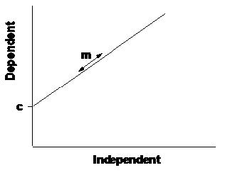
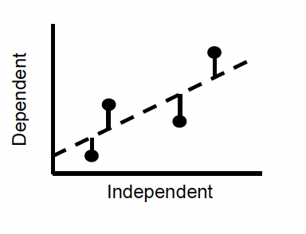

# Workshop 4 - Testing for and Measuring Relationships

## Introduction 

In this week’s practical we are going to test for relationships or associations between different variables. There are two basic methods for testing for associations: 

1) Correlation analysis measures the strength of the relationship between two variables.
2) Regression analysis is used to estimate an equation that best describes the effect of one variable upon another.

In regression analysis, we are interested in the effect of an independent variable on a dependent variable. In scatter plots, the independent variable is always plotted on the horizontal x-axis, whilst the dependent variable is always plotted on the vertical y-axis.

### Direction of associations {-}

Regressions or correlations can be positive (y-values increase as x- values increase), negative (y-values decrease as x-values increase) or there may be no relationship (no change in y-values as x-values increase). The commonest form of regression analysis is linear regression, which fits a straight line to the relationship. In linear regression analysis, there are three key steps:

1) Find the line that best describes the association between the two variables and assess whether the slope of this is significantly different from zero.
2) Determine the strength of the relationship (how well the data fit the line).
3) Determine the coefficients (slope and intercept) of the equation that describes the line.

The linear equation relates the dependent variable (y) to the independent variable (x), through two parameters:

* m is the slope: this is the rate of change in the y-variable as the x- variable increases. The larger the value of the slope, the faster y increases as x increases.
* c is the intercept: this is the value of y when x is equal to zero. The intercept therefore measures the position of the line on the y-axis.

The parameter m is of greatest biological interest to us in regression analysis, as it measures the extent of change in y that results from a unit change in x.

__The regression equation__
$$
y=mx+c
$$
```{r, eval=TRUE, echo=FALSE, out.width="40%", fig.alt= "Linear regression", fig.cap ="Linear regression"}

```

### Fitting the regression {-}

Linear regression analysis basically works by finding the values of m and c that minimise the deviations of the observed data from the line (ie the distance of each point from the line). This is most commonly done using the least squares method, in which the squared deviations of the points from the line are minimised.

```{r, eval=TRUE, echo=FALSE, out.width="40%", fig.alt= "Fitting the regression", fig.cap ="Fitting the regression"}

```

The deviations of points from the fitted line are termed residuals, and the best fit line is the one with the lowest residual variation. The residual variation is thus the amount of variation in the data that is not explained by the line. The fit of the line is measured by r$^2$, which is the proportion of the variance in y variable explained by x variable.

There are two ways to determine whether the relationship described by the fitted line is likely to have arisen by chance or not;

1) If there is no change in the y-values as x-values increase, the slope of the relationship is zero. We can therefore use a one-sample t-test to ask whether the slope of the relationship differs from a slope of zero. To do this, we need to compute a standard error for the slope, which is similar to the standard error of a mean. The SE of a slope measures our confidence in that slope, as it tells us where the true slope is likely to lie in relation to our estimate. Using n-2 DF we can calculate the 95% confidence intervals for the slope from;
$$
m ± t*se 
$$
If these CIs do not overlap zero, then there is a greater than 95% probability that the slope is different from zero, and we can then conclude that there is a significant relationship.

2) Alternatively, we can assess how different the slope is from zero by comparing the variance accounted for by the line with the total amount of variance in the y variable. If the line does not account for much of the variance in the data, then the overall variance will be much greater, and we cannot differentiate the slope from zero. This significance is assessed using an F-ratio in ANOVA.

In fact these two tests are equivalent! The value of F is always the square of the value of t that we can estimate from the SE of the slope.

### Assumptions {-}

There are 3 main assumptions, which are __different__ from the assumptions of the tests for differences;

1) the deviations of points from the line (residuals) are evenly distributed along the line.
2) the variance of these residuals is constant across the range of values of x (homoscedasticity).
3) the measurement error in the x-axis is zero (or at least negligible in comparison to the error in the y-axis).

### Correlation {-}

In some circumstances we are not attempting to measure the effect of one variable on another, we are just interested in the strength of association between two variables x and y, without inferring anything about the nature of cause and effect. The association between two variables is measured using the correlation coefficient, which measures the degree to which the joint variation in the data (the covariation) differs from the total variation in the data. This coefficient, denoted as r, is therefore a ratio that varies between -1 and 1, and measures the strength of the association between x and y;

* r = 1 indicates that two variables are perfectly positively correlated.
* r = 0 indicates that two variables are entirely uncorrelated.
* r = -1 indicates that two variables are perfectly negatively correlated.

It is important to be aware that the existence of a high correlation between two variables does not imply a cause-effect relationship. Quoting correlation coefficients without an understanding of the underlying patterns of association between variables is therefore dangerous. The covariation between two variables may simply be due to the effects of a third, unmeasured variable. Regression analysis should, therefore, only be applied when the cause-effect mechanism that is assumed in the regression equation is valid.

## Practical 4 - Regression & Correlation Introduction

This week we are going to look at statistical techniques involved in testing for associations between variables.

### The Data

During the 1950s, radioactive waste leaked from a storage area into the Columbia River, Washington, USA. For nine counties downstream in Oregon, an index of exposure was calculated (based on distance from the leak site and average distance of the population from the river). The cancer mortality was also calculated for each county (deaths per 100,000 person-years, 1959-1964). Data were collected by Anderson and Sclove 1978

Because this data set is very small, we can enter this into R manually. 

### Task 1 - Setting up your workspace {#manual-data-entry} 

Log into posit Cloud and return to your instance in the class work space. Set up a new script in posit Cloud. Once again you will probably want to tidy your environment using the following (**make sure you have last weeks script saved in your `scripts` folder first**);

```{r}
# Clean up your environment
rm(list = ls())
```

You will need to make sure the packages `tidyverse` and `moderndive` are installed and loaded to complete todays workshop, check Chapter \@ref(workspace-setup) and Chapter \@ref(script-setup) if you are unsure how to do this. 

As previously mentioned, the data set for this part of practical is relatively small, so we can enter it into R manually (this also gives you a chance to learn a little more code).

First of all we need to create a new object for each variable, and store our data accordingly. Try running the following; 

```{r}
exposure <- c(8.3, 6.4, 3.4, 3.8, 2.6, 11.6, 1.2, 2.5, 1.6)
cancer <- c(210, 180, 130, 170, 130, 210, 120, 150, 140)
```

Now we need to combine our individual variables into a single data frame, to do this we can use the function `tibble()`. Try running the following;

```{r}
exposure_cancer <- tibble(exposure, cancer)
```

> * Use some of the functions from Chapter \@ref(checking-the-data) to exlore this data set. 
> * Are you happy you understand how we generated the new dataframe?

### Task 2 - Making some basic plots {#c6t2}

Lets start by taking a look at how your data are spread. We can do this by making a scatter plot. Last week we used `ggplot()` to make some boxplots and histograms, we can also use this function to make scatter plots. Try running the following;

```{r}
# Create a scatter plot to look at the relationship between radiation 
ggplot(data= exposure_cancer, aes(x = exposure, y = cancer)) +
  geom_point()
```

Hopefully R has produced a scatter plot in your plots panel exploring the relationship between radiation exposure and cancer mortality. 

> * Does there appear to be any relationship between the cancer rate and radiation exposure?
> * What is the direction of the relationship?

### Task 3 - Regression analysis {#c6t3}

On the basis of medical evidence, we have strong reasons to suspect that elevated radiation can cause increased cancer mortality. As this hypothesis specifies a cause-effect relationship, we can use a regression analysis to assess the extent to which this radioactive leak can explain the observed cancer mortality rates.

We can modify the scatter plot you made in Task 2 to fit a regression line or line of best fit to your plot. Try adding the following line to your scatter plot code (dont forget to add a `+` to pipe to your new line of code);

```{r}
 geom_smooth(method='lm')
# here we are instructing R to fit a line using the method `lm` which is an abbreviation of linear model
```

There are, of course, some assumptions about the data that must be checked before relying on the outputs from a regression analysis. The two key assumptions of linear regression are;

1) The deviations of points from the line (residuals) must be evenly distributed along the line.
2) Yhe variance of these residuals must be constant across the range of values of x (homoscedasticity).

You can often assess these assumptions with visual inspection of the graphs, and it can also help to plot the residuals (difference between the actual value of y and the value predicted from the equation) against the predicted values (values of y predicted from the equation for each value of x). Positive residuals indicate actual values that are greater than predicted values (i.e. points that lie above the line), and negative residuals are less than the predicted values (i.e. points lying below the line). If the regression assumptions are met, then a plot of residuals against predicted values should give a random scatter of points with no systematic pattern or bias. A positive or negative trend in this plot would indicate heteroscedasticity, a wedge-shape would indicate a greater spread of data at one end of the line and a U-shape would indicate a non-linear relationship.

First of all, lets build our model, try running the following;

```{r}
model01 <- lm(cancer ~ exposure, data = exposure_cancer)
# Here we are creating a new object called model01
# In this object we are placing a linear model as described by the lm() function
# We are then specifying that we want to analyse cancer (our response variable) as a function of exposure (our predictor variable) using tilde (~). We then just tell R which data frame we are using with the data = exposure_cancer argument. 
summary(model01)
# Summary() will just print out a summary of our model for us to interpret.
```

Don't worry too much about interpreting the summary table yet, first lets check some of our assumptions. We can plot out our residuals against our predicted values to check their distribution and homoscedasticity using the following piece of code, try running it now; 

```{r}
ggplot(model01, aes(x = .fitted, y = .resid)) +
  geom_point()
```

You can also check to see where these data points have come from with the following;

```{r}
get_regression_points(model01)
# export regression points in a table of outcome/response variable, all explanatory/predictor variables, the fitted/predicted value, and residuals.
```

By looking at these latest two outputs (your residuals vs predicted values plot and regression points table) try to answer the following; 

> * Do the residuals plot into a nice even band?
> * Is there any sign of a wedge-shaped distribution with an increase in variance at one end?
> * Is there any sign of a U-shape in the residual plot, indicating that non-linear regression might be needed?

It is important to check thoroughly the assumptions of regression, as datapoints exerting a disproportionate influence can have dramatic impacts on the results. If all assumptions are met, you can now explore the regression output, rerun the `summary(model01)` line. You should get an output that looks like this;

```
> summary(model01)

Call:
lm(formula = cancer ~ exposure, data = exposure_cancer)

Residuals:
    Min      1Q  Median      3Q     Max 
-19.161 -11.934   3.741   8.969  17.226 

Coefficients:
            Estimate Std. Error t value Pr(>|t|)    
(Intercept)  118.449      8.365  14.161 2.08e-06 ***
exposure       9.033      1.480   6.103  0.00049 ***
---
Signif. codes:  0 ‘***’ 0.001 ‘**’ 0.01 ‘*’ 0.05 ‘.’ 0.1 ‘ ’ 1

Residual standard error: 14.58 on 7 degrees of freedom
Multiple R-squared:  0.8418,	Adjusted R-squared:  0.8192 
F-statistic: 37.24 on 1 and 7 DF,  p-value: 0.0004898
```

There is a lot of information here so we will break each section down.

First of all we have a reminder of the formula we gave to the `lm()` function;

```
Call:
lm(formula = cancer ~ exposure, data = exposure_cancer)
```

Then we have a summary of our residuals;

```
Residuals:
    Min      1Q  Median      3Q     Max 
-19.161 -11.934   3.741   8.969  17.226 
```

We have already explored our residuals in some depth so I wont go into a huge amount of detail around this summary, you can read around it if it interests you.

Then we have our coefficients summary;

```
Coefficients:
            Estimate Std. Error t value Pr(>|t|)    
(Intercept)  118.449      8.365  14.161 2.08e-06 ***
exposure       9.033      1.480   6.103  0.00049 ***
---
Signif. codes:  0 ‘***’ 0.001 ‘**’ 0.01 ‘*’ 0.05 ‘.’ 0.1 ‘ ’ 1
```

If we look at the `Estimate` column, the `(Intercept)` is the intercept in the traditional sense, this would be where the regression line meets the Y axis, when exposure is zero. So we can think of this as cancer mortality will be 118 deaths per 100, 000 when the radioactive exposure index is zero.  Now if you look at the `exposure` `Estimate` this is 9.033, this represents the slope of the regression line. If we were to translate this into words we could think of this as for every unit increment in exposure, cancer mortality increases by c.9 deaths per 100, 000. We can test this theory mathematically.

Plug your intercept and slope values into the y = mx + c equation to estimate the mortality of a county with an exposure index of 6. You can do this by typing 9.003 * 6 + 118.449 into the console in R. Compare this output to the scatter plot for exposure and cancer mortality that we made earlier today. 

Regarding the other values represented here, the `Std. Error` (Standard Error) measures the average amount that the coefficient estimates vary from the actual average value of our response variable. We can use these to calculate confidence intervals if required. 

The `t values` represent our T statistic, this is simply the coefficient divided by the standard error. A large T statistic will have a small standard error proportionally to its coefficient, so the T statisitc is really saying that our coefficient is X standard errors away from zero and the larger the T statistic the more certain we can be that our coefficient is not zero. Finally we have our `Pr(>|t|)` which represents our p value. This is calculated using our T statistics and a T distribution (as seen in lectures). The significance codes denoted by `*` help you interpret the size and significance threshold of the p value. These are essentially telling you how confident you can be that your coeffieient is not zero.

Next we have our  Residual standard error and R^2^ values;

```
Residual standard error: 14.58 on 7 degrees of freedom
Multiple R-squared:  0.8418,	Adjusted R-squared:  0.8192 
```

The `Residual standard error` helps describe how well our data fit the model. If we think of our residuals as the distances our observed data points are away from the regression line then our residual standard error is the average amount that the observed data points differ from the predicted data points, shown by the regression line, in units of Y.

We then have two R^2^ values. The `Multiple R-squared` value is mostly used if your model only has one predictor (as in this case). It tells us the percentage of variation within our responce (dependent) variable that is explained by our predictor (independent) variable. The `Adjusted R-squared` value is used when we have multiple predictor variables included in our model. It can be interpreted in the same was as the `Multiple R-squared` value but it shows the percentage of the variation in the response variable that is explained by all predictor variables. The differences in calculation are slightly nuanced, you dont need to worry about them here. 

Finally we come to our F-statistic;

```
F-statistic: 37.24 on 1 and 7 DF,  p-value: 0.0004898
```

When we run a linear regression our null hypothesis is that there is no relationship between our two variables, you could also think of this as the null hypothesis stating that the coefficients for your variables are zero. So the alternative hypothesis would be that your coefficients for at least one of your variables is not zero. The `F-statistic` and associated `p-value` tests this hypothesis. Once again the larger your F statistic the more likely your result is to be significant and we can then use the p-value to measure the probability of seeing an F-statistic of that size if the null hypothesis were true.

Now we know how the summary output for our model is broken down we can start to interpret our results, from the `summary()` output for `model01` try to answer the following;

> * How strongly is the cancer rate related to the radiation exposure? (Remember - the R^2^ value tells you what proportion of the variation in y is explained by x, from 0 to 1).
> * Is this relationship statistically significant (look at the p-value, which indicates the overall significance of the regression)?
> * What is the slope of the regression line?
> * How much does the cancer rate increase for an increase in exposure of 1 unit?
> * For an increase in exposure of 20 units, how much would you expect the cancer rate to increase?
> * What is the intercept of the slope?
> * What does this intercept mean in real terms?
> * What is the standard error of the slope and what does this tell you?
> * Does the slope differ significantly from zero (look at the t-value of the slope, and the associated p value)? What does this tell you (bearing in mind that a slope of zero =no relationship).

We can also calculate confidence intervals for the slope and the intercept. For example, we can be 95% confident that the true values of our estimates lie somewhere between the upper and lower range of values given by the 95% CIs. The confidence intervals are calculated from:

__Slope:__
$$
m ± t*se 
$$
__Intercept:__
$$
c ± t*se
$$
For 95% CIs, there is a 5% chance of the true value being outside these limits, thus there is a 2.5% chance it is less than the lower limit and a 2.5% chance it is greater than the upper limit. The appropriate t value for large degrees of freedom is 1.96, so if you want a crude estimate of the 95% CIs, t = 2, ie ±2 standard errors from the estimate.

> * Calculate the 95% confidence intervals for the slope of the regression. What do these tell you? (Note: if you want to be precise, for 7 degrees of freedom, t = 2.365).
> * What cancer rate would you expect to find in a hypothetical county with an exposure index of 5? You can estimate this from the graph and calculate it from the regression equation.

We often want to use fitted regressions to make predictions. These predictions can be made in two different ways;

1) __Predicted values:__ predicting a mean value of y for a given value of x. If there were several counties with an exposure rate of 5, they would probably have slightly different cancer rates, due to natural variation. The cancer rate predicted from the regression equation is the mean rate for such counties. As this is a mean, it has a standard deviation, and the output also gives the 95% confidence interval (CI). We can be 95% sure that the mean lies between these upper and lower values.
2) __Prediction Intervals:__ predicting a range (e.g. 95%) of values of y for a given value of x. We call this the ‘prediction interval’ (PI) to distinguish it from the ‘confidence interval’ (CI) for the mean. Individual values are scattered around the mean, thus the PI for an individual county is wider than the CI for the mean of many counties.

> * What would you expect the cancer rate to be at an exposure index of 40?
> * Is this a valid prediction?

### Task 4 - correlation analysis  {-}

In cases where there is no biological reason to expect a cause-effect relationship, we can still assess the degree of association between two variables, by measuring the extent to which they co-vary (i.e. as one variable changes, so does the other). The data listed below report the annual biomass of North Sea cod (in ‘000 tonnes), from 1980 to 2006.

In the `data` folder you should find a file called `cod_biomass.csv`. Load this file into your workspace using the `read_csv()` function. Use some of the commands from Chapter \@ref(checking-the-data) to check the data and then use `ggplot()` to make a simple scatter plot. Try to answer the following questions; 

> * Does there appear to be a temporal trend in cod declines?
> * In which direction is the trend?

Now we can calculate the Pearson (or product-moment) coefficient of correlation, using the command;

```{r}
correlation01 <- cor.test(cod_biomass$year, cod_biomass$cod_biomass, method = "pearson") 
# perform a correlation test on year and cod_biomass in the cod_biomass data set using Pearson's correlation coefficient. 
correlation01
# print the information stored in correlation 01
```

> * In the output the sample estimates is the correlation coefficient what does this value tell you?
> * What is the statistical significance of this association?
> * Could you have run a regression analysis on these data?

## Conclusion

This week we have looked at how we can analyse and interpret relationships, either through regression analysis or through correlation analysis. 

## Before you leave!

Make sure you save your script and download it if you would like to keep a local copy.

Please log out of posit Cloud!

## References

Wickham, H., Averick, M., Bryan, J., Chang, W., D’Agostino McGowan, L., François, R., Grolemund, G., et al., 2019. “Welcome to the tidyverse.” Journal of Open Source Software 4 (43): 1686. https://doi.org/10.21105/joss.01686. <br />

