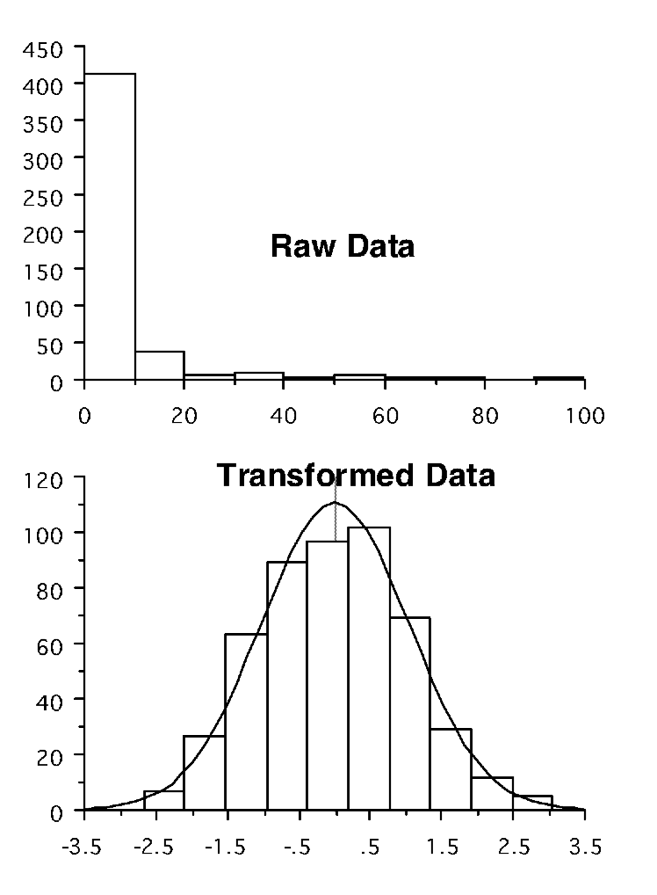
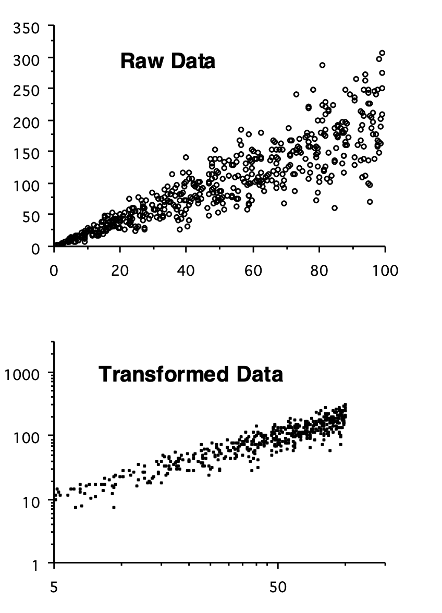
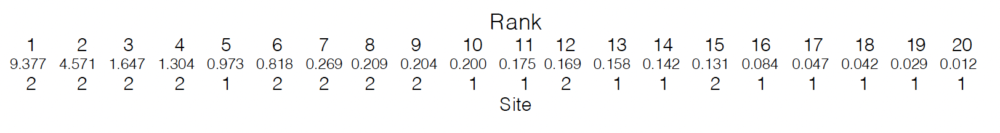

# Workshop 5 - Issues with Probability and Parametric Analysis

## Introduction

Statistical analyses allow us to estimate the probability that a given effect will occur by chance alone. As a matter of convention, if the probability of a given effect occurring is less than 1 in 20 (i.e. p<0.05), then this effect is considered to be so unlikely to arise by chance that we can reject the null hypothesis of no difference or relationship.

There are two problems with using probability levels to determine whether an effect we see in our data is likely to be of significance;

1) Type I error occurs if we reject a null hypothesis when it is actually true (e.g. our t-test indicates a statistically significant difference, but in fact the populations do not differ).
2) Type II error occurs if we accept a null hypothesis when it is in fact false (e.g. our t-test does not indicate a statistically significant difference, when in fact the populations do differ).

Both of these problems arise because we cannot state for certain whether two populations differ or whether two variables are related: we can only use the information at hand to state the probability. For example, if we conduct 100 tests of the same null hypothesis we would expect 5 to be statistically significant, even if the null hypothesis were true. When conducting a large number of tests of the same null hypothesis, we could partially overcome this problem by lowering our critical p-value. Alternatively, a technique called a sequential Bonferroni correction can be used to correct for a large number of tests of the same hypothesis. Often, however, the most sensible solution is to place more confidence in strongly (e.g. p<0.001) than weakly (e.g. p<0.05) significant results.

Ultimately, when we repeatedly test the same hypothesis, we cannot be completely certain that every effect we deem to be significant / non-significant is indeed so; we have to rely on an understanding of the system, and broad-scale patterns in our data, as much as rely on individual p values.

### Non-normal data & homogeneity of variance {-}

The t and F distributions use information about the variance in estimates of population parameters, but they can only do this if a set of specific assumptions are met. All of the tests we have discussed so far rely on either data being normally distributed or residuals being evenly distributed. If this is not the case then all of the theory that predicts the likely behaviour of population parameters from our sampled estimates breaks down, and our tests are therefore invalid. This has been emphasised throughout, and we saw in an earlier practical how we could explore our data distribution using frequency histograms. Similarly, we saw that t-tests & ANOVAs assume that the variances of all our groups are the same, whilst the regression analysis assumed that the variance in our dependent variable did not change with the value of our independent variable. We saw earlier how Levene’s test could be used to test this assumption of homogeneity of variance.

If we find that either the assumption of normality or of homogeneity of variance is violated, then often it is possible to overcome the problem through transforming our data. In Figure 7.1, the upper graph shows data that are extremely skewed; the lower graph shows that when these data are log- transformed, they then appear very normal.

```{r, eval=TRUE, echo=FALSE, out.width="40%", fig.alt= "Impacts of log transformations - distribution", fig.cap ="Impacts of log transformations - distribution"}

```

Similarly, we can use a transformation of our data to meet the assumptions of regression analysis. In Figure 7.2, the upper scatter plot shows data that are inappropriate for linear regression, since the variance about the line increases with the value of the independent variable. The transformed data show a much more even distribution of residuals.

```{r, eval=TRUE, echo=FALSE, out.width="40%", fig.alt= "Impacts of log transformations - variance", fig.cap ="Impacts of log transformations - variance"}

```

### Transformations {-}

A number of useful transformations exist;

1) __Logarithmic:__ remember that the logarithm of a number x is the number to which 10 (or e) has to be raised in order to give x: e.g. log10(100) = 2 since, 100 = 10$^2$; log10(1000) = 3 since, 1000 = 10$^3$, and so on.
2) __Logarithmic +1:__ if we have some measurements of zero, or close to zero, then this may be a more effective transform that simply taking the logarithm. This is calculated as log(x+1).
3) __Square Root:__ This operates in a similar fashion to the logarithmic transform and is especially used in regression analysis when the log-transform often goes a bit too far.
4) __Arcsine-square root:__ This is used on proportional or percentage data, especially when the mean of the data is close to 0 or 1 (0 or 100%). This is calculated as: sin^-1^($\sqrt{x}$). This helps to overcome the problem that such data are bounded, i.e. not continuous.

Transformation of data is a powerful and very important technique for overcoming the problem of non-normality and heterogeneity of variances. It is important to note, however that transforming data can affect our interpretation: e.g. if we compare the mean of untransformed data, and the back-transformed mean of our transformed data, then these will not be the same. This should be borne in mind in interpreting results.

### Non-parametric methods {-}

In some cases it is not possible to transform data to a normal distribution. Data may also have been collected in ranks, or have measured an index of some variable we are interested in. To cope with these kinds of problems, a variety of statistical analyses have been developed that do not rely on assumptions about the distribution of data. They work somewhat differently, and in particular do not work by predicting the likely values of population parameters from statistics estimated from samples. In general, this is done in one of three ways;

1) __Median tests;__ by analysing the median of the data, rather than the mean: you may remember that in the first practical we remarked that the median of our data is less sensitive to extreme values in our data and the skew of the distribution than the mean.
2) __Rank tests:__ By ranking data, i.e. sorting them into order and exploring the position of each observation. For example, in tests of differences, one group may rank higher than another and, in tests of association, the ranks of observations will be similar on both axes if an association exists.
3) __Patterns of deviation;__ Or we can look at patterns of deviation, for example to say whether a prediction tends to systematically over- or under- predict on the basis of positive and negative differences, or whether higher than average scores (positive deviations) or one variable tend to be associated with higher than average scores in another.

### Non-parametric tests for differences {-}

The Mann-Whitney test is the non-parametric equivalent of the t- test. It is based on ranking data, and tests whether the location of one sample is different from that of another. This gives a statistic called U that, if greater than a critical value, indicates that there is a difference between the two groups.

The non-parametric equivalent to the one-way ANOVA (when we wish to test for differences between several rather than just two groups) is called a Kruskal-Wallis test. This yields a statistic H that, if greater than a critical level, indicates the existence of differences between our groups.

The most common design of two-way ANOVA is randomised block design, and the non-parametric equivalent for this is called Friedman’s method for randomised blocks. For a regular two-way ANOVA, the Schreirer-Ray-Hare extension to the Kruskal-Wallis test may be employed (see Sokal & Rohlf 1995; pp446-447).

### Non-parametric tests for association {-}

The most commonly employed non-parametric tests for association are Spearman’s and Kendall’s correlation coefficients, based again on ranking data. These both yield coefficients that are comparable to the correlation coefficient, and if greater in magnitude than a critical level indicate the existence of a significant correlation.

For regression analysis, a technique called Kendall’s robust line-fit method, details of which may also be found in Sokal & Rohlf (1995).

### Pitfalls of non-parametric tests {-}

Most of the tests mentioned above rely on ranking methods - they therefore have to be able to deal with the existence of ties in the data, i.e. when two measurements have the same ranks. Often, when using these tests, you will see two outputs, one normal, and the other ‘corrected for ties’.

As you can probably guess from the names of these non- parametric tests, many mathematicians have sought fame and fortune through designing a ‘distribution-free analysis’. There are, therefore, many tests that do more or less the same thing, and which give basically the same results. Those mentioned above are generally the most commonly used. There are also methods for constructing models in which you can define the structure of the data (called generalised linear models), which we will explore in the next module.

## Practical 5 - Transformations & Non-parametric Tests - An Introduction

The techniques we have so far used to test for differences and associations are all parametric tests, which estimate population parameters from samples in order to test hypotheses. As we have seen, however, these tests make some assumptions about data that, if violated, would lead to results being invalid. In the previous classes we saw how we could check the assumptions of our analyses in order to determine whether the results will be valid. In this practical we are going to introduce some techniques that can be used if we believe that the assumptions of our parametric analysis have been violated. In the first section we will show how it is possible to transform data in order to overcome problems with the shape or variance of our data. In the second section we will introduce two simple non-parametric analyses, for use when our data either cannot be normalised, or when we have data (e.g. counts, scores, ranks) that would be inappropriate for analysis with parametric techniques.

### Task 1 - Setting up your workspace

Log into posit Cloud and return to your instance in the class work space. Set up a new script in posit Cloud. Once again you will probably want to tidy your environment using the following (**make sure you have last weeks script saved in your `scripts` folder first**);

```{r}
# Clean up your environment
rm(list = ls())
```

You will need to make sure that the package `tidyverse` is installed and loaded to complete todays workshop, check Chapter \@ref(workspace-setup) and Chapter \@ref(script-setup) if you are unsure how to do this.

The data for the first part of todays practical are the weights (g) of individual plants originating from seed taken from two sites. Each was grown singly in pots in a greenhouse, with the arrangement of pots being completely random.

The data set for this part of practical is relatively small, so as in the previous chapter, we can enter it into R manually.

First of all create two objects called `site1` and `site2` and fill them with the following data points (check Chapter \@ref(manual-data-entry));

```
Site 1; 0.142, 0.084, 0.029, 0.175, 0.047, 0.012, 0.042, 0.200, 0.973, 0.158
Site 2; 1.304, 1.647, 0.269, 0.209, 0.131, 0.818, 4.571, 9.377, 0.204, 0.169
```

Once you have your `site1` and `site2` objects you can then use the `tibble()` function to create a data frame called `seeds`. 

Use `view()` to inspect your new data frame. 

> * What do you notice about the layout of these data? 
> * Are these data in a long or a wide format?
> * What kind of format do we need them to be in?

Hopefully you identified that the data in `seeds` are in a wide format and we need them in a long format. Tidyverse has a lot of very helpful functions for wrangling data into the format that we need it to be in. Here, we can use the `pivot_longer()` function to manipulate our data. Try running the following, taking time to read each line of code and understand what each section does;

```{r}
seeds2 <- seeds %>%
  pivot_longer(cols = site1:site2,
             names_to = "site", 
             values_to = "weight")
# Here we are piping out initial seeds data set into the pivot_longer() function
# We are then telling the function which columns we with to be included within the seeds data frame
# The names_to argument is allowing us to name our categorical variable 
# The values_to argument is allowing us to name our numeric variable
# We are then saving the output from this function to the object seeds2
```

Now use the `view()` function on your new `seeds2` data frame, can you identify what the `pivot_longer()` function has done?

### Task 2 - Explore the data {#c7t2}

Spend a little time exploring the data. Try using the `group_by()` and `summarise()` functions to find the means, standard deviation and the standard error of the plant weights for each site (see Chapter \@ref(descriptive-statistics) if you need help with this). Build some histograms to explore data distribution and maybe consider building a boxplot to explore differences between sites (see Chapter \@ref(histogram) if you need help with this). 

> * Does there appear to be any difference between the two sites?
> * Does the distribution of data appear to be normal? (remember we have only a small number of observations so we would hardly expect a perfect bell-shaped pattern).

Now try comparing the two sites with a levenes and a two sample t-test (check Chapter \@ref(levene-test) if you're not sure how to do this).

> * Does this test indicate that the two groups differ?
> * What does the Levene’s test tell you about the variances of the two groups?
> * What are the assumptions of a t-test, and do you think that these data conform to them?

### Task 3 - Data transformations {#c7t3}

Basically there are two problems with these data;

1) The data (particularly those from site 2) are highly skewed 
2) The variances for the two groups are very different, which could mean that a parametric test may fail to detect a difference, if it exists (although if the difference between the two groups is very large, a parametric test may detect the difference despite the assumptions not being met). 

We can attempt to meet these assumptions by transforming the data. Since the data are spread over several orders of magnitude (e.g. in site 1 we have values ranging from 0.012 to 0.142: the former measurement is ten times the size of the latter), a logarithmic transformation is likely to be appropriate.

Thankfully this is a very easy addition we can make in our `seeds2` dataframe. Try running the following piece of code;

```{r}
seeds2 <- seeds2 %>%
  mutate(log10 = log10(seeds2$weight))
```

Use the `view()` command to take a look at your `seeds2` dataframe. 

> * The log10 expression means to take the logarithm to the base 10. With this in mind, do you understand what the mutate() function has done? 
> * Add some appropriate comments to your script to describe the above code.

Repeat the data explorations that you carried our in Chapter \@ref(c7t2) on the new log10 column. 

> * Is there still a difference between the two sites? (Remember that the true population mean for each group will lie within approximatly 2 standard errors either side of the mean)
> * How does the distribution of data compare with what we saw before?

Carry our a levenes test and two sample t-test on the two log transformed groups. 

> * Does this test indicate that the two groups differ?
> * What does the Levene’s test tell you this time about the variances of the two groups?
> * How do these results compare with the analysis of the un-transformed data?

The transformation of the data has basically achieved what we wanted: the variances of the two groups are now not statistically different, and the transformed data are considerably less skewed than the raw data. A t-test comparison of these data is more likely to yield robust results.

### Task 4 - Non-parametric analysis of the differences

One of the most striking features of the original data is that most of the larger values are for the data for site 2, whilst most of the smallest values are for site 1. This is very clear if we sort the data into order, and give each pot a rank:

```{r, eval=TRUE, echo=FALSE, out.width="90%", fig.alt= "rank orders", fig.cap ="Rank Orders"}

```

Work out the mean ranks of the pots taken from the two sites (you can either do this manually or see if you can write a piece of R code to do this).

> * Do these mean ranks tell you whether one site tends to produce bigger plants than the other?

In the top 10 positions, only 2 pots are from site 1, whilst in the last 10 positions, only 2 pots are from site 2. Clearly, irrespective of the spread or mean of these data, the plants from site 2 tend to be bigger than those from site 1. This is the basis for the first non-parametric test that we are going to look at, the Mann-Whitney test. This test simply compares the ranks of the data from our two groups, and determines whether one of the groups tends to occupy the top or bottom positions more frequently than we would expect by chance.

Copy over the following piece of code and run it from your script; 

```{r}
# Mann Whitney U / Wilcoxan 
wilcox.test(weight ~ site, data=seeds2) 
```

Although this is called a Wilcoxon test, if you run the test on two independent samples (as we have here), R runs a Mann-Whitney U test (confusing I know). Here we have performed a Mann-Whitney U test. The W value is our test statistic and p-value is fairly self explanatory. The key statistic to look at is W (if you are familiar with MannWhitney U tests, this is equivelent to the traditional U value): this measures the difference between the ranks for the two groups; a large value indicates a large difference in ranks.

> * The null hypothesis is that there is no difference between the groups: does the probability value indicate that this is likely to be the case?

The non-parametric test works very differently to the t-test - in particular it ignores any information on the mean and variance in the data. Note that strictly speaking, it tells us whether the location of the data from two groups is different, not whether the means are different.

### Task 5 - Non-parametric test for associations

Finally we are going to look at a non-parametric test that enables us to tell whether there is a significant association between two variables.

The data are taken from a study on aphids: `mother` records the total length of 15 aphid stem mothers, and `offspring` records the mean thorax length of their (numerous) parthenogenetic offspring, taken from visual estimates under a microscope.

```
mother; 8.70, 8.50, 9.40, 10.00, 6.30, 7.80, 11.90, 6.50, 6.60, 10.60, 10.20, 7.20, 8.60, 11.10, 11.60 
offspring; 5.95, 5.65, 6.00, 5.70, 4.70, 5.53, 6.40, 4.18, 6.15, 5.93, 5.70, 5.68, 6.13, 6.30, 6.03 
```

Use the above data to create a new data frame called aphids, with two 2 columns titled; mother and offspring. Create a scatter plot to see whether there appears to be any association between these two variables.

> * What would be the problem with using parametric correlation or regression analyses to look at this association?

Basically there are two problems here;

1) There is error in both axes: the lengths of the mothers are estimated rather than accurately measured and the offspring lengths are averages.
2) The pattern of association is not linear: the significance test for a parametric correlation coefficient requires a linear association.

There are two (very similar) non-parametric measures of correlation. These again rely on ranks: i.e. they test whether high-ranking mothers produce high ranking offspring.

First of all try running the following to have R assign a rank to each of the variables; 

```{r}
aphids <- aphids %>%
  mutate(rank_m = rank(aphids$mother)) %>%
  mutate(rank_o = rank(aphids$offspring))
```

> * Do you understand what each line of code is doing here? Try to add comments to it in your script. 

If there is a correlation then we would expect the biggest mother to have the biggest offspring, and the smallest mother to have the smallest offspring. Create a scatter plot from your ranked variables. 

> * Does it appear that the rank of the offspring follows that of the mother?

We can see if there is a correlation using the Spearmans Rank correlation coefficient. Try running the following;

```{r}
cor.test(aphids$mother, aphids$offspring, method = "spearman")
```

You will get the following warning;

```
Warning message:
In cor.test.default(aphids$mother, aphids$offspring, method = "spearman") :
  Cannot compute exact p-value with ties
```

This is because some of the ranks are tied in the offspring variable. We can edit our code so that we can still get an estimate of the correlation coefficient by editing our command to read as follows;

```{r}
cor.test(aphids$mother, aphids$offspring, method = "spearman", exact = FALSE)
```

The coefficients that this analysis generates are structured in the same way as the normal (Pearson’s) correlation coefficient: a magnitude of 1 indicates perfect positive correspondence; a value of 0 indicates no association.

> * What does the coefficient tell you?
> * Is it statistically significant?

## Conclusion

Today we have explored how to deal with data that breaks the assumptions made by parametric tests. We have seen what the impact of log transformations and ranking data has on its structure and have played with a few non-parametric tests to test for differences and associations. 

## Before you leave!

Make sure you save your script and download it if you would like to keep a local copy.

Please log out of posit Cloud!

## References

Wickham, H., Averick, M., Bryan, J., Chang, W., D’Agostino McGowan, L., François, R., Grolemund, G., et al., 2019. “Welcome to the tidyverse.” Journal of Open Source Software 4 (43): 1686. https://doi.org/10.21105/joss.01686. <br />

