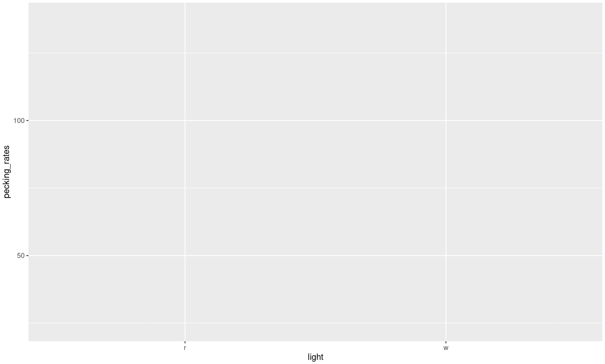
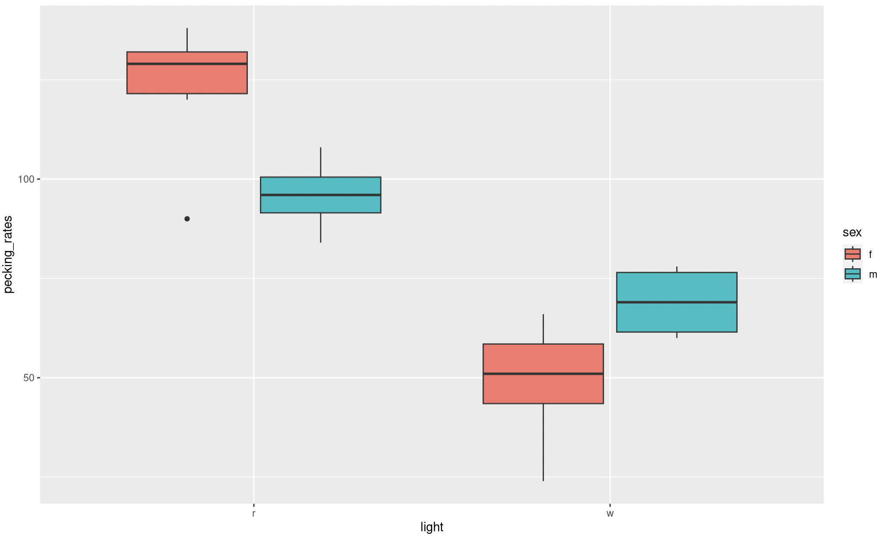

# Workshop 7 - Plot Beautification!!!

So far, in this workbook, we have used a number of different plots to explore our data. They have served their job well and given you a good overview of what the data look like. Which is absolutely fine, while you are tinkering and exploring with your data sets. However, that wont fly when it comes to sharing your analysis outputs; be that in a summative coursework piece, a presentation (verbal or poster) or a professional publication. Thankfully, `ggplot()` has some fantastic features for making plots look absolutely stunning, and we can quickly make a draft plot look absolutely fabulous very quickly. 

This is a crash course in plot beautification using `ggplot()`. It is by no means an exhaustive list of all the aesthetic parameters you can edit, but it will give you a good grounding.

## Deconstructing ggplot

Hopefully you have been saving the code from former workshops in a sensible place in the project spaces in our posit Cloud class room. Back in Chapter \@ref(first-boxplot) we made a boxplot comparing the pecking rates between male and female chickens. Initially, we will work with this same plot. So log into posit Cloud and join the class room workspace, then return to your instance of __Workshop_4__. You will see that the workspace has lots of stuff from last time in your `Environment`. Its best to try and start with a nice clean environment for todays workshop. Don’t worry about loosing things from your environment, provided you have __saved your script__ in your `script` folder and have the raw data .csv file you will be able to reproduce all of those analyses from before. If you run the following piece of code, everything stored in your environment will be removed, giving you a nice clean area to work in;

```{r}
# Clean up your environment
rm(list = ls())
```

Now load your script from Practical 2, Chapter \@ref(differences), load the `tidyverse` package and create a `chickens` object containing the `pecking_rates.csv`. 

To get an idea of how ggplot works we are going to go back over some code you have already run. Try running the following, what happens?

```{r}
# Making a box plot and saving it in an object
# Call the ggplot function and direct it to your data, define your x axis and y axis and colour your plots by sex
pecking_rates_box <- ggplot(data = chickens,aesdata = chickens, aes(x = light, y = pecking_rates, fill = sex)) 
print(pecking_rates_box) # Print the object your plot is stored in to view it
```

So you have given ggplot your data set and specified the axes. But you haven't told it how you would like the data to be visualised. So you should see something like this...

```{r, eval=TRUE, echo=FALSE, out.width="90%", fig.alt= "Basic ggplot output", fig.cap ="The most basic output from ggplot"}

```

Now modify the script so that it looks like this...

```{r}
# Making a box plot and saving it in an object
# Call the ggplot function and direct it to your data, define your x axis and y axis and colour your plots by sex
pecking_rates_box <- ggplot(data = chickens,aesdata = chickens, aes(x = light, y = pecking_rates, fill = sex)) +
  geom_boxplot() # Tell ggplot that you want it to build a box plot
print(pecking_rates_box) # Print the object your plot is stored in to view it
```

Note the `+`, this is essentially another way of piping information from one function into the next. You could also have added `fill = sex` to an `aes()` function within the `geom_boxplot()` function.

Your figure should look like this...

```{r, eval=TRUE, echo=FALSE, out.width="90%", fig.alt= "Basic ggplot boxplot", fig.cap ="A basic ggplot box plot output"}

```

Have a look at this figure, is there anything you would change, to make it more visually appealing or clear? 

Here are some things I would change:

* Labels
* Colour scheme
* Spacing
* Theme

We will look into how to edit these elements now. 

## Labels

Clear accurate labeling is essential in the sciences, be it when your in the lab labeling up your samples or creating data visualisations.

In our current plot both our x and y axis could do with some relabeling, just because we dont use capitals when coding doesn't mean we don't follow the normal rules of English grammar when presenting data. Try adjusting your code so that it looks like the following;

```{r}
# Making a box plot and saving it in an object
# Call the ggplot function and direct it to your data, define your x axis and y axis and colour your plots by sex
pecking_rates_box <- ggplot(data = chickens,aesdata = chickens, aes(x = light, y = pecking_rates, fill = sex)) +
  geom_boxplot() + # Tell ggplot that you want it to build a box plot
  labs(x = "Light Colour", y = "Number of Pecks (per 15 minutes) \n") # Adjust your x and y axis labels
print(pecking_rates_box) # Print the object your plot is stored in to view it

```

Note the `\n` on your y axis label. This simply adds a new line to the label and spaces it nicely away from the y axis. 

This looks a bit better but our key is still not very well labeled. Adjust your `labs` function so that it reads `labs(x = "Light Colour", y = "Number of Pecks (per 15 minutes) \n", fill = "Sex")`. This will change the label for your key. 

Our labels still aren't quite right, I don't like the abbreviations on the x axis and our key could still use some work as there are no units given for the treatment temperatures. Try these changes;

```{r}
# Making a box plot and saving it in an object
# Call the ggplot function and direct it to your data, define your x axis and y axis and colour your plots by sex
pecking_rates_box <- ggplot(data = chickens,aesdata = chickens, aes(x = light, y = pecking_rates, fill = sex)) +
  geom_boxplot() + # Tell ggplot that you want it to build a box plot
  labs(x = "Light Colour", y = "Number of Pecks (per 15 minutes) \n", fill = "Sex") + # Adjust your x and y axis labels as well as your key heading
  scale_x_discrete(labels = c("Red","White")) + # Rename the categories on the x axis 
  scale_fill_manual(labels = c("Female", "Male")) # Rename your key labels
print(pecking_rates_box) # Print the object your plot is stored in to view it
```

Note that the `scale x discrete` and `scale_fill_manual` functions simply rename things in the same order as you present them, make sure you label your categories accurately or this can make a big mess later on.

If you try to remake your plot at this stage you will get the following error:

```
Error in `palette()`:
! Insufficient values in manual scale. 2 needed but only 0 provided.
Run `rlang::last_trace()` to see where the error occurred.
```

This is because `scale_fill_manual` is also expecting some instructions on how to colour your boxplot. You will need to complete Chapter \@ref(colours) before you can successfully remake your boxplot. 

## Switching up colours {#colours}

The colours of your boxes are the default colours given by `ggplot()`. We can modify these to make our plot look a bit more pleasing. Try editing the `scale_fill_manual` function to this `scale_fill_manual(labels = c("Female", "Male"), values = c("cornflowerblue", "coral"))`. Run it and see what happens to your plot. 

What do you think of your new plot now? Do you think the changes to labels and colours are an improvement?

R has lots of [colours](https://www.datanovia.com/en/blog/awesome-list-of-657-r-color-names/), take a look at the linked reference lists and have a play with changing up some of your colours. 

Colour can be a really useful tool to employ when making your plots visually appealing, however make sure you are mindful that some colour pallets can be difficult for some people to interpret. There are however, some really good [tips](https://www.tableau.com/en-gb/about/blog/examining-data-viz-rules-dont-use-red-green-together#:~:text=Use%20a%20colour%2Dblind%2Dfriendly%20palette%20when%20appropriate&text=For%20example%2C%20blue%2Forange%20is,blue%20to%20someone%20with%20CVD) out there for making sure your figures are accessible to everyone. 

## Spacing

Lets have a look at spacing. This is a box plot so we the main spacing option you are likely to want to play with is the width of your boxes. Here we can simply add an argument to the `geom_boxplot()` function. Edit this function so that it reads `geom_boxplot(width = 0.9)`. The width argument can be anything between 0.00 or 1.00. It changes the width of the boxes and this changes the spacing between them as well. Have a play with some values and see what happens. 

We will come back to spacing when we look at our scatter plots later. 

## Themes

Another aspect of aesthetics that we can look at is themes. We have a reasonably attractive graph now, but its still got a grey background and the grid lines are unnecessary. To remove the grey background and implement the classic black on white aesthetic we can simply add a function that defines a pre-made theme. Adjust your script so that it includes the function `theme_bw()`, I suggest you add this as a new line, don't forget to pipe between your functions with a `+`. Run this chunk and print your new plot. How is that looking now? 

Two things still jump out at me when looking at this plot. The grid lines are completely unnecessary and detract from the overall aesthetic and the text sizes could be larger. To make these edits we can simply add additional instructions to adjust the theme further. So although most of the work has been done by applying a the `theme_bw` we still need make some adjustments. 

Add the following function to your growing ggplot chunk (don't forget to pipe `+` between functions);

```{r}
theme(panel.border = element_rect(color="black"), # Specifies that the plot boarder is coloured black
        panel.grid.minor = element_blank(), # Removes minor grid lines 
        panel.grid.major = element_blank()) # Removes major grid lines 
```

Now we just need to adjust the text size. We can do this within the `theme` function as well adjust your theme so that it reads like this;

```{r}
theme(panel.border = element_rect(color="black"), # Specifies that the plot boarder is coloured black
        panel.grid.minor = element_blank(), # Removes minor grid lines 
        panel.grid.major = element_blank(), # Removes major grid lines 
        axis.text = element_text(size = 15), # Changes the size of text on both axis 
        axis.title = element_text(size = 20), # Changes size of your axis labels 
        legend.text = element_text(size = 15), # Changes the size of text within your legend
        legend.title = element_text(size = 20)) # Changes the size of the legend title
```

Have a play with the different text sizes until you think they are optimal. You may need to press the zoom button in the viewer panel to get a clearer idea of the scaling. 

Hopefully you now have a nice clean, clear and aesthetically pleasing plot and have some awareness of the commands and functions used to make it.

## Beautifying scatter plots

In Chapter \@ref(c6t2) and \@ref(c6t3) we made a very simple scatter plot for radiation exposure against cancer mortality (deaths per 100,000 person-years, 1959-1964) across nine counties in the US. Reopen this project (**Workshop_5**) and take a look at your script from this workshop, recreate the accompanying data frame and rebuild your `geom_point()` plot.  

Use you previous chunks of code and knowledge of R to edit the labels and themes of this plot. Print it again and take a look.

Now there are some additional elements in this plot that could be adjusted. These include;

* Point shape - The shape of the individual points on the plot, as with colours there are lots of options numbered 0 - 25, descriptions of each one are listed here
* Point size - The size of each point
* Point colour - The colour of your points
* Line type (solid, dashed, etc) - Again thre are several options here, the notation and descriptions of which can be found here
* Line colour
* Line size - the weight of the line
* Line fill - Note that here this refers to the colour of the shaded area marking the standard error

So lets play with some of these. Try adding and adjusting the following arguments within `geom_point()`

* `shape = 1` - have a look at other point shapes you could use and play with this setting
* `size = 2` - again try playing with some point sizes
* `colour = "blue"` - or any other colour you fancy trying.

Once you are happy with your points we can take a look at your regression line. Try adding and adjusting the following arguments within `geom_smooth()`

* `colour = "cornflowerblue"`
* `fill = "lightblue"`
* `size = 1`
* `linetype = "dashed"`

As before please do experiment and play with the settings described by each of these arguments.

## Exporting your plot to pdf

Once you are happy with your new and beautiful plots make sure you save it to to the figures folder using a function called `ggsave()`. This will allow you to export your plots as `.pdf` files which you can then download and put in your reports/publications. 

You will need to have your plots saved as an object (using the `<-` syntax) before this will work. You can call these objects whatever makes most sense to you. Try running the code below for each of your beautified plots; 

```{r}
# Saving outputs
ggsave("figures/pecking_rates_boxplot.pdf", # Give R a path to save to and a file name
       plot = pecking_rates_box,# Tell R what to save - in this case your object
       width = 15, # Set .pdf width
       height = 10, # Set .pdf height
       units = "cm", # Specify units for .pdf width and height
       device = "pdf") # Tell R what file type to create, in this case a pdf
# Note, use trial and error to select a good width and height for your figure
```

Note that if you remove the `device = ` line `ggsave` will automatically create a `.png` file. You can also use `width = , height = , units = "cm"` arguments to specify the size of your figure in cm. You will need to adjust these by trial and error until the proportional sizing of your plot to axis and legend labels is pleasing. This chunk will save your plot to the `figures` folder. From here you can download your figures by checking the box besides the file, clicking `More` and then `Export...` and `Download`.

## Before you leave!

Make sure you save your script and download it if you would like to keep a local copy.

Please log out of posit Cloud!

## References

Wickham, Hadley, Mara Averick, Jennifer Bryan, Winston Chang, Lucy D’Agostino McGowan, Romain François, Garrett Grolemund, et al. 2019. “Welcome to the tidyverse.” Journal of Open Source Software 4 (43): 1686. https://doi.org/10.21105/joss.01686. <br />
Wickham, Hadley, Winston Chang, Lionel Henry, Thomas Lin Pedersen, Kohske Takahashi, Claus Wilke, Kara Woo, Hiroaki Yutani, and Dewey Dunnington. 2021. Ggplot2: Create Elegant Data Visualisations Using the Grammar of Graphics. https://CRAN.R-project.org/package=ggplot2.