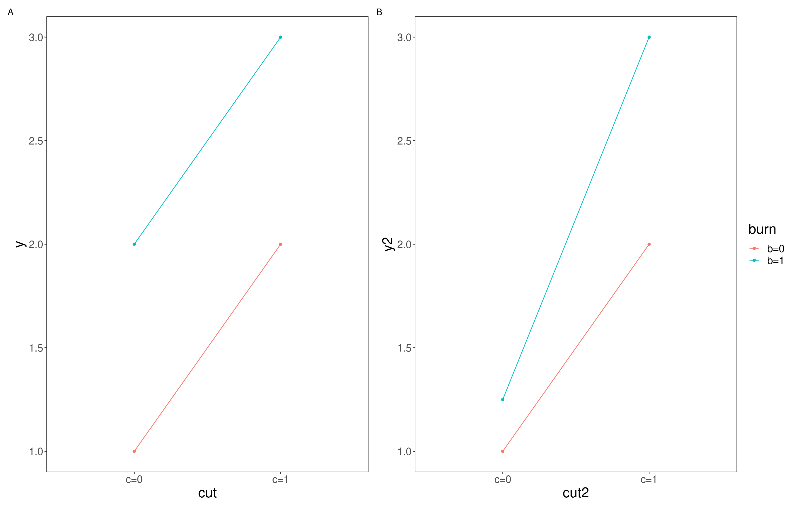

# Model Structure

This chapter will run in Workshop 8 of Week 9.

## Introduction

Linear models use analysis of variance (ANOVA) as the statistical technique to partition the variation in a dependent variable among predictors. In addition, the effect of interactions between predictors on a dependent variable can be quantified in the linear model. Linear models can be constructed with continuous and/or categorical variables but the design of the study must be considered when designing the right model structure to use.

### Fully Factorial Linear Model

The simplest form of linear model is fully factorial, in which replicates are completely randomised. The potential disadvantage of this design is that random allocation of replicates can, by chance, result in a patchy distribution, e.g. replicates of one treatment might all end up close to one another. 

### Randomised Block Linear Model

In this design, replicates are grouped into blocks but randomly distributed within blocks. Analysis of block designs is very similar to factorial designs except that you generally have to tell the computer that you are using a block design by customising the model. In a block design, the blocks are not replicated and so the interactions between block and the other treatments can’t be assessed. Thus, the customised model has to restrict the interactions between treatments to those not including block.

### Options

There are several options within linear models which will allow further assessment of the data.  A key one is Homogeneity of Variance, which tests the assumption of equal variances across the treatments. 

### Post-hoc
Post-hoc tests are pairwise comparisons that compare all combinations of the treatment groups.  There are many post-hoc tests which vary in exactly how they deal with Type I and Type II errors. The most commonly used is the Tukey test. Ideally, variances and sample sizes will be similar between treatments and most multiple comparison tests are fairly robust to deviations from these assumptions.

## Practical 7 - Exploring Model Structure

In this weeks first workshop we will be analysing two separate data sets; Nepal and Tulips. You can find these in the data folder for the BIO-7025A classroom. As always, try to pay special attention to the data interpretation steps and make sure you understand the logic behind each of the decisions made.

Once you have logged into the Posit cloud classroom, spend some time cleaning up your workspace environment and setting up your workspace and script as covered in Chapter \@ref(workspace-setup) and Chapter \@ref(script-setup). You will need to install and load the packages `tidyverse`, `GGally`, `lmerTest`, `car` and `PerformanceAnalytics` for this session. 

## Data set 1: Nepal - Linear Model with Randomised Block designs

As an introduction to the analysis of more complex study designs, we are going to look at a randomised block design. This form of design is often used to control for natural variation across an experimental area. 

The data we are going to analyse today are taken from an experiment conducted by Nic Peet, a former UEA PhD student, on the effects of different forms of management on the species composition of Nepalese grassland. The details of the experiment are as follows:

This is a randomised block experiment consisting of four blocks, each containing four treatments: cutting, burning, cutting and burning and no management. Each plot measured 35 x 35 m and was surrounded by a 3m wide fire line. Cutting involved removing all above-ground biomass in a plot, and was carried out by local people using sickles. Vegetation monitoring was carried out immediately pre-treatment, in the last week of November 1994, 1995, & 1996. The data we have are for the percentage cover of *Imperata cylindrica*, one of the dominant species in the plots.

*	nepal.csv data file

This file contains the following data:

* cut: 		plots that were cut (1) or not (0)
* burn:		plots that were burned (1) or not (0)
* treatment: a summary column of cut (c), burn (b), cut and burn (cb) and control (control) treatments 
* block:		the block that each plot was within
* year1994:	% cover of *Imperata cylindrica* in 1994
* year1995:	% cover of *Imperata cylindrica* in 1995
* year1996:	% cover of *Imperata cylindrica* in 1996

> Note: although these data are percentages, they tend to be in the range 20-80%, so there is no need to arcsine-transform the data as this would have little effect.

### Task 1 - Checking the data

Load the dataset `nepal.csv` into your workspace under the object name `nepal` and try performing some routine checks to make sure R has interpreted the variables correctly and all expected data is present and accounted for. You can use some of the functions explored in Chapter \@ref(checking-the-data) if you need some help with this. 

> Look at each of your variables, are any of them categorical? Has R characterised them as double (`dbl`), character (`chr`) or factor (`fct`) variables? 
> Do some of these need to be changed? Remember you can use the `as.factor()` function to alter these (see Chapter \@ref(c11t1)). 

Sometimes we want R to order the different categories within a factor in a specific way (R works alphabetically by default). Lets see how R has ordered our `treatment` variable. Run the following;

```{r}
# Report levels within the treatment variable 
levels(nepal$treatment)
```

You should get an output that looks a little like this;

```
> levels(nepal$treatment)
[1] "b"       "c"       "cb"      "control"
```

Really it would be great if we could have `control` as the reference to compare other treatments to, so it would be good if we could reorder this. Try running the following;

```{r}
# Set control as the reference level within treatment
nepal <- mutate(nepal, treatment = relevel(treatment, ref="control"))
```

Rerun the `levels()` function, can you see what we have done here? This will be helpful for later analyses. 

### Task 2 - Exploring the data

Draw some histograms for each of the three dependent variables (% cover), and explore the assumption of data normality. You may find it most efficient to manipulate the data to a long form format and then use `facet_wrap()` to combine your plots, as below;

```{r}
# Rearrange the Nepal data set into a long format
nepal2 <- nepal %>%
  pivot_longer(cols = year1994:year1996,
               names_to = "year", 
               values_to = "perc_cover")

# Plot histograms for percentage cover and split plots by year
ggplot(data = nepal2, aes(x = perc_cover)) +
  geom_histogram() +
  facet_wrap(vars(year))
```

> * Do you understand what each line of code is doing here? Comment your script appropriatly. 
> * Is the assumption met for all three groups?

Now try to produce three box-plots for treatment against percentage cover. Use the same method with `facet_wrap()` to produce one plot per year. See if you can manipulate this code to add raw data points to the plot (hint `geom_point()`) and colour these by block.

> * What can you deduce from these plots?

### Task 3 - Identifying experimental design {#c12t3}

Before starting the analysis, you need to be very clear about the study design.

> * Draw a diagram of the experimental set-up, following the description given above. How does the design differ from a fully randomised design?

The basic differences between this design and the fully randomised design are that Block is not replicated (there is only one block 1, one block 2 etc) and all plots within each block occur next to each other. Consequently, we cannot analyse the experiment as if it were a fully randomised factoral design. 

To illustrate the problem with analysing this experiment as if it were a fully factorial design (even though it is not fully factorial), we will try constructing a model from our first `nepal` dataset with year1994 as the dependent variable, and treatment and block as interacting factors. Try running the following;

```{r}
# Construct our first linear model exploring how much variation in percentage cover in the year 1994 is explained by treatment and block variables
lm1 <- lm(year1994 ~ treatment * block, data = nepal)
summary(lm1)
```

> *	What does the output of this analysis tell you? 

As stressed above, this experiment cannot be analysed as if it were a fully factorial design. The problem is that the analysis is trying to assess all the interactions with `block`, but this can’t be done because `block` is not replicated. 

Now, to do the analysis correctly, we need to customise a model that doesn’t compare all interactions (as in fully factorial) but only those that are actually replicated.  As `block` is not replicated, all interactions with this have to be removed. We will come back to this shortly but first we need to think about the different ways in which we could go analysing the treatments within our model. 

### Task 4 - Approaches to our model

There are two ways we could approach this model. Use `glimpse()` to examine your initial `nepal` data frame again. You will notice we have three columns that define the different treatments each segment in each block was exposed to (i.e. control, cut, burn and cut & burn). These are described in two different ways, we have the `cut` and `burn` columns that have either a 0 (to signify that this treatment was not used on this segment) or a 1 (to signify that this treatment was used on this segment) and the combination of 0's and 1's indicated each of the four possible combinations. We then have our `treatment` column which summarises the `cut` and `burn` columns with characters (control = control, c = cut, b = burn and cb = cut & burn). So how do these different notations effect our analysis?

We could run our analysis (as we did above) to include effects of the `treatment` and `block` factors and ignore the `cut` and `burn` factors. If we use `treatment` as one of our fixed factors in this way we will essentially be performing a one-way ANOVA with four levels (corresponding to the four treatments). Lets ignore `block` for now and think about what this means. Run the following;

```{r}
# Construct a linear model exploring how much variation in percentage cover in the year 1994 is explained by treatment alone 
lm1 <- lm(year1994 ~ treatment, data = nepal)
summary(lm1)
```

> * Take a look at the output for `summary()`. What is this telling you?

So first of all we can see here that treatment does not explain a significant amount of the variation in percentage cover of *Imperata cylindrica*. But the trouble with this analysis is that we cant really assess if there is an interaction between the the `cutting` and `burning` treatments. This model is only looking at additive effects, we cant really say anything about any interaction effects which may be in play. 

If we want to test for interactions in this instance, we need a design that more closely resembles a fully factorial design, this will let us test and compare additive effects with interactive effects. We can get an indication of whether an interactive effect is in play by looking visualisations of out data. If an additive effect is occurring with no interaction we might expect additional factors to shift the intercept up or down but the slope to remain fairly constant (as seen in panel A of Figure 12.1). On the other hand if  interactive effects were occurring we might expect the combined effect of the two factors to be different to the result of us adding the individual effect together (as seen in panel B of Figure 12.1).  

```{r, eval=TRUE, echo=FALSE, out.width="90%", fig.alt= "additive vs interactive effects", fig.cap ="Additive vs interactive effects, A; shows an additive effect where the intercept of the two factors is different but they share a slope, B; shows an interactive effect where the interaction effect changes the relationship and so the slope also changes"}

```

> * Take a look at your initial box plots, do you think there is likely to be an interactive effect of the cut and burn treatments on *I. cylindrica* cover in 1994? 

Looking at the medians here, I would guess that an interactive effect between cut and burn treatments is unlikely. But we might like to test this interpretation. This is where having our data in a factorial lay out may be helpful. Try running the following;

```{r}
# Construct a linear model exploring how much variation in percentage cover in the year 1994 is explained by additive and interactive effects of cut and burn treatments and additive effects of block variables
lm2 <- lm(year1994 ~ cut *burn + block, data = nepal)
summary(lm2)
```

Remember from Chapter \@ref(c12t3) we ascertained that we couldn't look for interactions with block because block isn't replicated, so here we have simply requested it be included only in an additive capacity. However we can now explore potential interactions between cut and burn treatments. 

> * What is the summary of your new model (lm2) telling you?

When incorporating fixed factors with more then two levels it can also be helpful to produce the ANOVA table for your model, this will tell you the overall amount of variation explained by each factor as a whole, try running;

```{r}
# Produce the ANOVA table for lm2
anova(lm2)
```

The variation explained by each factor is captured by the Mean sq column of this output table. The F value is then calculated by dividing the Mean sq of each line by the residual Mean sq. 

> * Are any of our factors explaining a significant part of the variation in percentact cover of *I. cylindrica*?

### Exploring the model

Lets unpack our `lm2` model a little bit more. The `GGally` package has a super useful function called `ggcoef_model` that produces a plot of the estimated mean difference with estimated 95% confidence intervals. Try running the following;

```{r}
# Produce plots for coefficients with 95% confidence intervals
ggcoef_model(lm1,
             show_p_values=FALSE,
             signif_stars = FALSE,
             conf.level=0.95)
```

And then run the above code again for `lm2`. 

> * Can you see the difference in how the models are structured? 
> * What are the 95% confidence intervals telling you here for `lm1`? Think back to our discussions in Univariate statistics around 95% confidence intervals.
> * How does this compare to the plot produced for `lm2`

These plots allow you to plot the estimated means and examine the interaction between treatments. Something seems to be going on with Block 3 which we may wish to investigate in more detail. We may wish to perform a Tukey test to examine these differences in more detail. To do this we will need to use the `aov()` function on our `lm()` and then perform the Tukey test on that. See below;

```{r}
# Run a post hoc Tukey test for lm2
lm2_aov <- aov(lm2)
TukeyHSD(lm2_aov, conf.level=.95)
```

> *	What does the Post-Hoc Tukey test tell you about the differences between blocks?
> * What does your overall analysis tell you  about the effects of cutting and burning in each block?
> * Repeat the analysis for years 1995 and 1996
> * Are the effects consistent across years?
> * Describe what the analysis shows about the effects of cutting and burning in each year.

The design of a study determines the type of statistical analysis that is appropriate, and it is therefore very important to consider the type of model that you intend to use when you are designing the study.

## Data set 2: Tulip - Linear Model with Randomised Block designs

Lets look at another data set; `tulip.csv`. These data are from a study of the effects of different levels of shade and irrigation on the production of tulip flowers. There are three shade treatments and three water level treatments, giving a total of nine combinations. The entire experiment was replicated over three different flower beds. 

The datafile therefore contains the following variables:

* bed: 		flower bed 1, 2 or 3
* water: 	water levels 1, 2 or 3
* shade:	shade levels 1, 2 or 3
* blooms: 	number of tulip blooms produced per plant

### Task 5 - Checking the data

Load the dataset `tulip.csv` into your workspace under the object name `tulip` and try performing some routine checks to make sure R has interpreted the variables correctly and that all expected data is present and accounted for. You can use some of the functions explored in Chapter \@ref(checking-the-data) if you need some help with this. 

> Look at each of your variables, are any of them categorical? Has R characterised them as double (`dbl`), character (`chr`) or factor (`fct`) variables? 
> Do some of these need to be changed? Remember you can use the `as.factor()` function to alter these (see Chapter \@ref(c11t1)). 

### Task 6 - Exploring the data

You are going to need to construct a linear model to explore how tulip flower production varies among the shade and water treatments. But first it may be helpful to visualise our data using box_plots. See if you can construct a box plot with `water` treatment on the x axis, `blooms` on the y axis and coloured by the `shade` treatment.

> * What do you notice about this plot? 
> * Do you notice any possible additive or interactive effects?

Before we start modeling, we need to check that our data meets the assumptions of the linear model. Start by calculating some descriptive statistics for each treatment and consider what you think the effects of the predictor variables and whether the data meet the assumptions of the linear model. Build some histograms and run Levenes Test to check the assumptions of the linear model – normality of the data for each treatment and equality of variance between treatments.

### Playing with  some models

Construct the linear model with `bloom` as the dependent variable and `bed`, `water` and `shade` as fixed factors. As with the Nepal data, you have a randomized block experiment here, as the water and shade treatments are replicated across three flower beds (blocks). You therefore have to customize the model with an interactive term between `water` and `shade` and an additive term for `bed` (remember, this is to avoid the model trying to look for interactions with `bed`).

> * Run the model and write down what the model output tells you about the effect of each treatment and the effects of the interaction between treatments on tulip production. You may find it helpful to use both `summary()` and `anova()` functions.  
> * Look back at your orrigional boxplot, does your analysis corroborate the plot? 
> * What is the effect of the treatments on tulip production

The interaction term of water:shade is significant (p = 0.005). You can see why most easily by looking at our orrigional box plot. At shade 1, there are big differences among the water treatments while, at shade levels 2 & 3, there is only a slight increase in blooms at water level 3. Shade 1 is the lowest shade level, and water 3 is the highest water level, so this suggests that watering more is most helpful when there is little shade, an interpretation supported by the low bloom response at water level 1 and shade level 1. 

The effect of water therefore depends on shade level. Tulip bloom production increases strongly with increasing water levels at low shade 1, but less so at higher shades.  However, overall there seems to be an overall positive effect on blooms going from 1 to 3 for any given shade level.

## Mixed effects linear models

In some cases, you may wish to include model predictors that may have an influence on your dependent variable but for which you only want to account for that effect, i.e. not measure it directly – these are known as **random** factors. For example, in both the Nepal and Tulip examples, the data were grouped together in space (**block** in Nepal and **bed** in Tulip). As an alternative to a customised model design, we could have included this grouping predictor as a random factor. 

If you are including random and fixed effects in one model we are constructing something called a mixed effects model, and random effects must have more than two levels (but ideally these models work best if you have at least 5 levels).

We will see if how this works now, with our `tulip.csv` data set. 

Previously, we constructed a customised linear model to analyse these data but an alternative would be to construct a mixed model and account for the non-independence of plants from the same flowerbed by including `bed` as a random factor. This will mean that the model accounts for the variation that can be attributed to bed but will not statistically compare the three flowerbeds. 

To construct a mixed effects model we will be making use of the function `lmer` from the `lmerTest` package. Try running the following;

```{r}
# Run a mixed effects linear model
mixed_model <- lmer(blooms ~ water*shade + (1|bed), data = tulip)
```

And then check out the output by using `summary()` and `anova()` functions. 

> * What does these functions tell you about the effects of water and shade on the numbers of blooms produced?
> * Compare the F values in the ANOVA output to those that you found when you constructed a customised linear model `tulip`.

You might have noticed that the `summary()` output for your mixed effects model is very similar to that of your standard linear model. And this is broadly true. The additional section to pay attention to is the `Random effects:` table, this gives you additional information on how much of the variation from your mixed effects model is explained by your random factor (in this case bed).

The results of these two modelling approaches are, in this case, the same and either of these models would be an appropriate way to analyse these data. In this case, including bed as a fixed or random effect makes little difference to the model but if there had been many different beds and a less balanced design, it is likely that the mixed model would be more powerful (as fitting `bed` as a random effect leaves more degrees of freedom for the model, and thus there is more power to find any effects that exist).

## Conclusions

Today we have explored how the way you conduct a study influences how you structure your model. We have examined the differences between additive and interactive effects and how to spot the hallmarks of each and we have dabbled with incorporating random effects into a mixed effects linear model. 

These sessions are very much introductions into the world of multivariate statistics and your knowledge will benefit from further reading. I highly recommend Getting Started with R; An Introduction for Biologists by Beckerman, Childs and Petchey for further reading.

## Before you leave!

Make sure you save your script and download it if you would like to keep a local copy.

Please log out of posit Cloud!


https://www.datanovia.com/en/lessons/repeated-measures-anova-in-r/#google_vignette