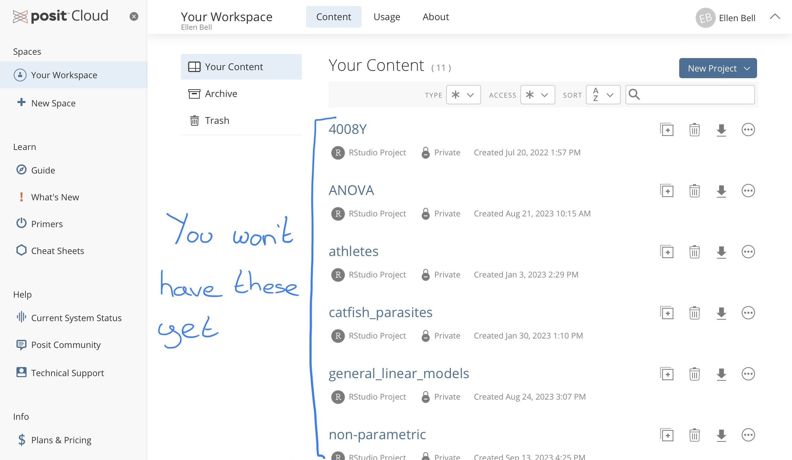
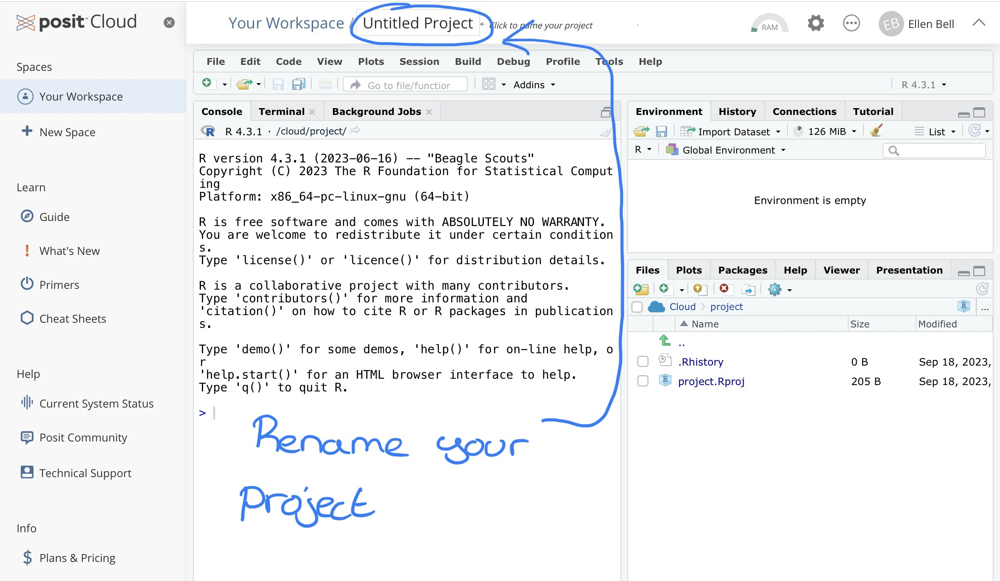
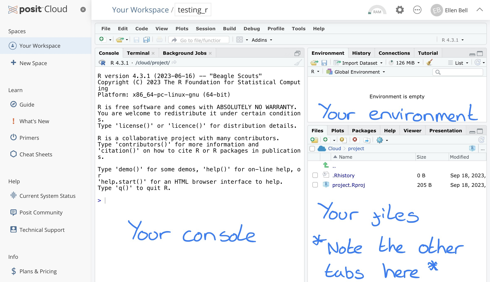
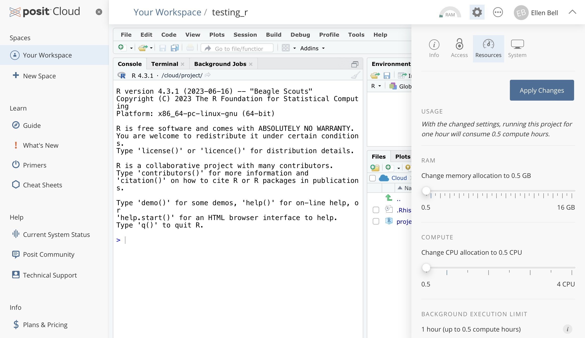

--- 
title: "Univariate Statistics"
author: "Dr Ellen Bell"
date: "`r Sys.Date()`"
site: bookdown::bookdown_site
documentclass: book
bibliography: [book.bib, packages.bib]
biblio-style: apalike
description: "This is the coursebook for Univariate and Multivairate Statistics"
link-citations: yes
github-repo: rstudio/bookdown-demo
always_allow_html: true
---

# Welcome to the Statistics Coursebook {#c1}

The aim of this course is to give a basic introduction to key ideas and techniques for statistical analysis. Most people find statistics difficult to learn - statistical analyses, however, play a central role in experimental biology, and a thorough knowledge of statistical techniques is essential in most areas of research. In order to conduct these analyses we will be learning and using the coding language R on the posit Cloud platform (more about this in a bit).

The key to success with statistics is practice. Whilst practical classes and lectures are useful in demonstrating how statistical analyses work and the kinds of problems that can be tackled, it is only with experience that much of statistics becomes understandable. The more you do the easier it will become. 

## Learning Objectives 

* To develop a sound understanding of the principles of statistical testing and probability.
* To be able to use and understand univariate tests of differences and associations.
* to develop confidence in understanding the outputs of univariate tests of differences and associations.
* To learn and gain confidence in use of R for data visualisation and data analysis.

## Teaching Layout

This is a 10 credit module which will run from Weeks 2 - 7

* 1 hour lectures run in weeks 2 - 7 which will cover elements of statistical theory 
* 3 hour practical sessions run in weeks 2 - 6 which give you a chance to explore some data sets, visualise data and conduct some statistical analyses in R. These are where you will be getting some real hands on experience of data management and analysis. 

## How to use this workbook

This workbook contains all of the information you require for the practical sessions (it was originally written by Rob Freckleton before being modified by Jenny Gill and then by myself). 

The practical sessions have been designed so that the data sets are small, tidy and fairly easy to manage. Should you wish to revisit these data sets, I highly recommend that you download them from the server based platform that we will be using (posit Cloud) and save them locally on your own devise.

## Why are we learning R

It is a common misconception, that to be a good biologist you need to ‘know’ the mechanics of how life works. Questions like; “How does a cell undergo respiration?”, “How do kidneys filter blood?”, “How do some plants fix nitrogen?” and “How do honey bees communicate the location and quantity of resources to each other?”, spring to mind. While these questions are important, they are also, now, fairly well understood. But how did biologists come to their understanding of these mechanisms? The answer to this lies in data.

Good science is based on empirical observations and these observations should be reliably collected and reproducible. Exploration of theories through observations and experimentation leads to the collection of data and analysis and interpretation of data feeds into the bedrock of our understanding of how life works, i.e. the biological sciences.

Hopefully you can see why data handling, analysis and interpretation are important. So why are we teaching you how to handle data using R?

To some of you, the use of programming languages, such as R, will be new. However if you can get into the habit of manipulating and analysing data in R you will be well set on the path to becoming an efficient and effective data analyst. Being confident with data is a key skill in the sciences and will serve you well in many career paths. In addition, knowledge and experience of programming languages such as R are fast becoming key skills in their own right, in science, industry, government and beyond.

In terms of the use of R for data handling and analysis, you may notice that the term __reproducible__ reoccurs throughout this workbook. In the same way that your methods of data collection should be conducted and recorded in such a way that they may be reproduced by others, your data manipulation and analysis must also be conducted and recorded so as to be reproducible. Using R within the posit Cloud interface makes it easy to record your data manipulation and analysis workflow and, if done well, makes it very easy for others to see and repeat what you have done.

## Introduction to posit Cloud {#intro-to-posit}

So what really is R and what is the difference between R and posit Cloud? 

Essentially R is a programming language that is commonly used in statistical computing, data handling, data visualisation and data analysis. Posit Cloud is a cloud based interface for a piece of software called RStudio (we wont be using the non cloud based RStudio here, so we wont explore this software further, however, it is something you may wish to consider downloading and installing on your own device). Posit Cloud uses the R programming language but has a nice user friendly interface and is a great tool for learning how to conduct analysis in R. 

We are using the posit cloud rather then RStudio because it means that no one has to worry about installing extra software on their own computers and everyone will be working with the same software versions. You will all need to create your own free accounts on posit Cloud, but first have a look at the short video below introducing you to the interface. 

<div style="position:relative;height:0;padding-bottom:40%"><iframe width="560" height="315" src="https://www.youtube.com/embed/3l02OgYYb0I" title="Intro to posit Cloud" frameborder="0" allow="accelerometer; autoplay; clipboard-write; encrypted-media; gyroscope; picture-in-picture" allowfullscreen></iframe></div>

<p>

### Task 1; Create your own posit Cloud account

Now that you've watched the video, create your own Free posit Cloud account [here](https://login.rstudio.cloud/login?redirect=%2Foauth%2Fauthorize%3Fredirect_uri%3Dhttps%253A%252F%252Frstudio.cloud%252Flogin%26client_id%3Drstudio-cloud%26response_type%3Dcode%26show_auth%3D0%26show_login%3D1).

### Creating your first posit Cloud Project

Once you have created an posit Cloud account you should be presented with this window

```{r, eval=TRUE, echo=FALSE, out.width="90%", fig.alt= "Screen for when you first login to posit Cloud", fig.cap ="Your workspace in posit Cloud"}

```

Under __Spaces__ go to __Your Workspace__ and under __Projects__ create a __New Project > New R studio Project__. 

```{r, eval=TRUE, echo=FALSE, out.width="90%", fig.alt= "Screen for creating a new project", fig.cap ="Creating a new project in posit Cloud"}
knitr::include_graphics("figures/posit2.jpg")
```

Lets name this project `testing_R`, notice that I have no spaces in my project name. Instead of a space I have used an underscore, there are a number of good habits you should try and adopt when naming projects or files and not including spaces is one of them, we will go over this in more depth in lectures and later chapters. You can rename your project by clicking on __Untitled Project__ at the top of the window, and typing in your new project name. 

```{r, eval=TRUE, echo=FALSE, out.width="90%", fig.alt= "Screen for renaming your project", fig.cap ="Renaming your project"}

```

You will see that your new project has three panels with tabs showing the Console, Environment and Files for your project. 

```{r, eval=TRUE, echo=FALSE, out.width="90%", fig.alt= "Screen for your r studio workspace", fig.cap ="The three basic panels of an R Studio workspace"}

```

### A warning on managing your work flow

Your free posit Cloud account comes with some restrictions which you should be aware of. These are;

* You may have up to 50 projects in total
* You are limited to 25 project hours per month
* You have up to 1GB of RAM and 1 CPU per project

For the purposes of our work here these restrictions should not be a problem. But I strongly suggest you don't leave your coursework to the last minute. There are some options of last resort should this happen, you could install RStudio on your desktop for example, or you could open a new free posit Cloud account with a different email address and copy your script over. But with both of these options we run the risk of things getting complicated. Lets avoid that where we can! There are some ways you can increase the efficiency of your workspace which are documented below in Chapter \@ref(efficiency).

### Maximising the efficiency of your workspace {#efficiency}

We know there are limited project hours on our free posit Cloud accounts. But equally we will only be working with very small data sets, so we can tinker with resource usage. To reduce your resource usage. In your project, go to settings (the cogwheel sign), Resources, and drag all of the sliders down to the minimum setting, apply the changes, this will mean the project has to restart. This will mean that running the project for 1 hour will consume 0.5 project hours. We wont be doing anything particularly computationally intensive so there is no need for RAM of CPUs to be higher. 

```{r, eval=TRUE, echo=FALSE, out.width="90%", fig.alt= "Making your project more efficient", fig.cap ="How to make your project more efficient"}

```

## Before you leave!

Log out of posit Cloud!